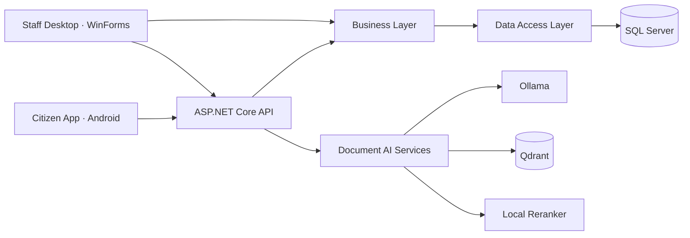

# DVLD — Driver & Vehicle Licensing Department

A graduation project for managing driving licence applications, examinations, and citizen services. DVLD combines a Windows desktop application for staff, an Android application for citizens, and a shared API backed by SQL Server.

The project also includes a document-based knowledge assistant and a question bank powered by local language models.

## Features

### Staff desktop application

- Manage people, employee accounts, driving licence applications, and test appointments.
- Issue and manage local and international driving licences, renewals, replacements, and detained licences.
- Create citizen mobile accounts, reset passwords, and activate or deactivate access.
- Upload knowledge documents and track their processing status.
- Create, edit, review, approve, and manage examination questions.
- Generate questions from documents in the background and track generation progress.

### Citizen Android application

- Sign in with a citizen account created by staff.
- View a dashboard with licence, application, and appointment information.
- Browse local and international driving licences.
- Access personal records through authenticated API requests.

### API and examination services

- Cookie-based citizen authentication with account validation on subsequent requests.
- Ownership checks for licence, application, and appointment records.
- Examination endpoints for starting attempts, saving answers, and submitting results.
- Server-side question selection and grading for the supervised examination workflow.

The official examination runs in the examination-centre computer workflow. It is separate from the citizen mobile application.

### Document AI

- Extract and process Arabic text from PDF documents.
- Create embeddings and store document chunks in Qdrant.
- Retrieve and rerank relevant passages for the knowledge assistant.
- Generate multiple-choice and true/false questions with source references and supporting evidence.
- Save generated questions as drafts for staff review before use.

## Technology stack

| Area | Technologies |
|---|---|
| Desktop | C#, Windows Forms, .NET Framework 4.8 |
| Mobile | Java, Android SDK, AndroidX, Material Components |
| API | ASP.NET Core, .NET 10 |
| Database | SQL Server, ADO.NET, Microsoft.Data.SqlClient |
| Android networking | Retrofit, OkHttp, Gson |
| Local AI | Ollama, Qwen models, retrieval-augmented generation (RAG) |
| Vector storage | Qdrant |
| PDF processing | PdfPig |

The business and data access projects target both `net48` and `net10.0`, allowing the desktop application and API to share the same domain code.

## Architecture



Staff workflows use the shared business layer directly. Android communicates through the API. Document processing and question generation run in background workers, while SQL Server stores administrative records, questions, and processing state.

The AI pipeline uses document retrieval rather than model fine-tuning. Generated questions require human review.

## Repository structure

```text
DVLD/                   Windows Forms application and .NET solution
DVLD.Mobile/            Android application
DVLD.Api/               API controllers, authentication, and background services
DVLD_Buisness/          Shared business layer
DVLD_DataAccess/        SQL Server data access
DVLD.AI/                PDF processing, retrieval, chat, and question generation
Database/Migrations/    Incremental database updates
docs/project-guide/    Detailed implementation guide
```

## Getting started

### Prerequisites

- Windows and Visual Studio with .NET desktop development support.
- .NET Framework 4.8 targeting pack and .NET 10 SDK.
- SQL Server and a database matching the project schema.
- Android Studio and Android SDK 36 for the mobile application. Minimum supported Android API level: 26.
- Ollama, Qdrant, and the local reranker service for document AI features.

### 1. Clone the repository

```bash
git clone https://github.com/emadAlaa2003/DVLD_GraduationProject.git
cd DVLD_GraduationProject
```

### 2. Configure the database

Restore the project database supplied by the team, then apply any required updates from [Database/Migrations](Database/Migrations/). These migrations are incremental; they do not create the entire database from scratch.

Set the `DVLD_CONNECTION_STRING` environment variable for the Windows account running the application. For a local instance using Windows authentication:

```text
Server=.;Database=DVLD_Grad;Integrated Security=True;TrustServerCertificate=True;
```

Adjust the server and database names to your environment, then restart Visual Studio or the terminal. The database must include `MobileUsers` to use citizen authentication.

Database backups, credentials, uploaded PDFs, and Qdrant data are not included in the repository. A SQL backup does not include the document files or vector store.

### 3. Run the desktop application and API

Open [DVLD/DVLD.sln](DVLD/DVLD.sln), restore NuGet packages, and build the solution. Start the `DVLD` desktop project with an active employee account.

Run the API from the repository root:

```powershell
dotnet run --project .\DVLD.Api\DVLD.Api.csproj --launch-profile https
```

The development profiles expose HTTPS on `7077` and HTTP on `5277`. See [launchSettings.json](DVLD.Api/Properties/launchSettings.json).

### 4. Run Android locally

Open `DVLD.Mobile` in Android Studio and sync Gradle. The current Debug client uses `http://127.0.0.1:5277/` through ADB reverse:

```powershell
dotnet run --project .\DVLD.Api\DVLD.Api.csproj --launch-profile http
adb reverse tcp:5277 tcp:5277
```

Run the Debug application on an ADB-connected device or emulator. Create a citizen account through **People → Manage Mobile Account** in the desktop application, then use the displayed credentials to sign in.

This HTTP setup is for local development. Release builds require an appropriate HTTPS endpoint. Session cookies are held in Android process memory and are lost when that process ends.

### 5. Enable document AI features

Download the configured Ollama models:

```powershell
ollama pull qwen3-embedding:0.6b
ollama pull qwen3:1.7b
```

Provide these services:

| Service | Local configuration |
|---|---|
| Qdrant | gRPC port `6334`; collection `dvld_knowledge`; 1024 dimensions; Cosine distance |
| Reranker | `http://localhost:8081/rerank` |

The reranker server implementation is provided separately. AI services are needed for document processing, chat, and question generation; they are not required for citizen login or licence retrieval.

## Project status

DVLD is an academic prototype under active development. The Android application currently covers login, the dashboard, and licence lists. Additional citizen screens and detailed employee permissions are being developed separately.

Background queues currently run in memory. The local Android configuration and supervised examination endpoints are intended for development and demonstration, not a public deployment configuration.

## Documentation

The [implementation guide](docs/project-guide/README.md) covers the desktop workflows, API, database access, AI pipeline, and examination services in detail, with file and method references.

- [Document processing and knowledge assistant](docs/project-guide/02-ai-documents-and-chat.md)
- [Background question generation](docs/project-guide/03-ai-question-generation.md)
- [API and official examinations](docs/project-guide/04-api-and-official-exam.md)
- [Android and citizen authentication](docs/project-guide/06-mobile-and-citizen-auth.md)
