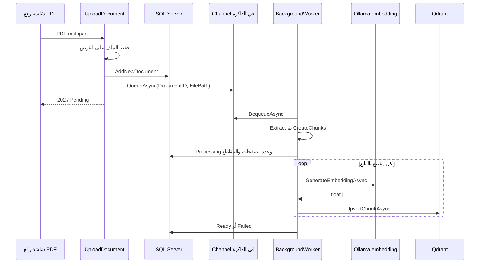
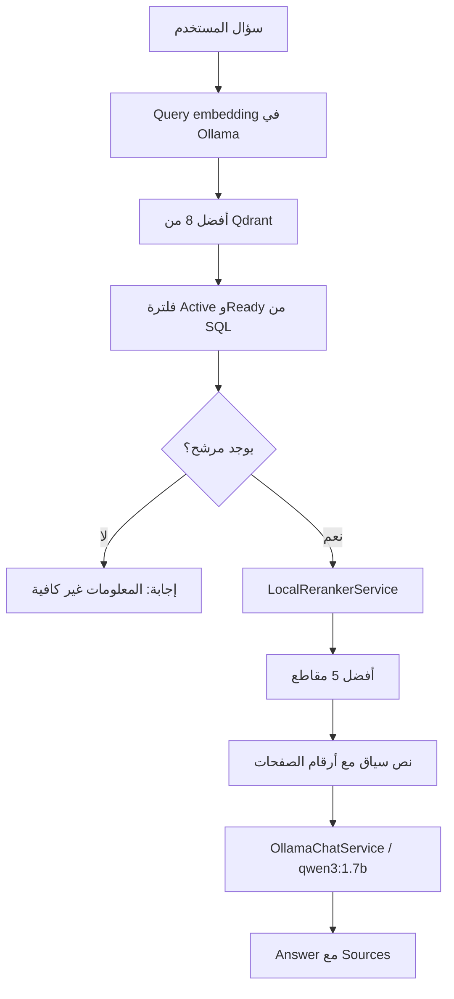

# دليل الذكاء الاصطناعي: الوثائق، الفهرسة، الاسترجاع والشات بوت

## 1. نطاق هذا الدليل وطريقة قراءته

هذا الشرح مستخرج من ملفات المشروع الحالية في مساحة العمل، بتاريخ 2026-10-06، ويشرح الكود الموجود فعلًا. لم تُشغّل استدعاءات Ollama أو Qdrant أو خدمة إعادة الترتيب أثناء إعداد هذا الدليل، ولم تُغيّر قاعدة البيانات. لذلك فإن أسماء الدوال والإعدادات وتدفق العمل حقائق من قراءة الكود، أما جودة الإجابات وسرعة التنفيذ فتحتاجان تجربة تشغيل مستقلة.

المسار الأساسي للنسخة المفحوصة هو `J:/gradeat project/DVLD Project Final/Project`. روابط الملفات أدناه تفتح المصدر المحلي، وأرقام الأسطر هي أرقام النسخة المفحوصة وقد تتحرك بعد تعديلات لاحقة.

هذا الملف يغطي رفع الوثائق واستخراج نصها وتقسيمه وتحويله إلى vectors، ثم البحث والشات بوت وإعادة المعالجة. مسار إنشاء أسئلة الاختبار له دليل مستقل، لكنه يستخدم نفس الوثائق والـchunks المخزنة في Qdrant.

## 2. الفكرة الأساسية: ما الذي يفعله الـAI هنا؟

النظام يستخدم استرجاع المعلومات قبل توليد الإجابة، وهو أسلوب RAG. لا يرسل كل كتاب المرور مع كل سؤال، ولا يدرّب النموذج من جديد عند رفع PDF. بدلًا من ذلك:

1. يستخرج النص من الوثيقة.
2. يقسم النص إلى مقاطع صغيرة، مع الاحتفاظ برقم الصفحة ومعرّف المقطع.
3. يحوّل كل مقطع إلى تمثيل عددي `embedding` ويخزّنه في Qdrant.
4. يحوّل سؤال المستخدم إلى embedding، ثم يبحث عن المقاطع القريبة منه.
5. يرسل السؤال والمقاطع المرشحة إلى خدمة تعيد ترتيبها.
6. يرسل أفضل المقاطع كنص سياق إلى نموذج المحادثة لكي يصوغ إجابة عربية.

توجد ثلاثة أنواع مختلفة من البيانات:

| المكان | ما الذي يُخزّن فيه؟ | الغرض |
|---|---|---|
| ملفات PDF على القرص | الوثيقة الأصلية باسم تخزين فريد | الرجوع للمصدر وإعادة استخراج النص |
| SQL Server: `KnowledgeDocuments` | أسماء الملف ومساره وحجمه والحالة وعدد الصفحات والمقاطع | إدارة الوثائق ومعرفة الجاهز منها |
| Qdrant: `dvld_knowledge` | embedding كل مقطع والنص وبيانات المصدر | البحث الدلالي واسترجاع مقاطع الوثيقة |

وجود سجل الوثيقة في SQL لا يعني أن فهرستها اكتملت. الاسترجاع الحالي يسمح فقط بوثائق `IsActive = 1` و`ProcessingStatus = 'Ready'`، عبر [clsKnowledgeDocumentData.GetActiveReadyDocumentIDs](<J:/gradeat project/DVLD Project Final/Project/DVLD_DataAccess/clsKnowledgeDocumentData.cs:454>).

## 3. خريطة الملفات والدوال الرئيسية

| الملف | الدوال الأساسية | الدور |
|---|---|---|
| [frmAddDecoument.cs](<J:/gradeat project/DVLD Project Final/Project/DVLD/Documents/frmAddDecoument.cs:79>) | `btnUpload_Click` | إرسال PDF من WinForms إلى الـAPI |
| [ProgressableStreamContent.cs](<J:/gradeat project/DVLD Project Final/Project/DVLD/Documents/ProgressableStreamContent.cs:27>) | `SerializeToStreamAsync`, `TryComputeLength` | حساب تقدم نقل بايتات الملف |
| [KnowledgeDocumentsController.cs](<J:/gradeat project/DVLD Project Final/Project/DVLD.Api/KnowledgeDocumentsController.cs:28>) | `UploadDocument`, `SearchKnowledge`, `Chat`, `ReprocessDocument` | HTTP endpoints الخاصة بالوثائق والبحث والشات |
| [KnowledgeDocumentProcessingQueue.cs](<J:/gradeat project/DVLD Project Final/Project/DVLD.Api/Services/KnowledgeDocumentProcessingQueue.cs:38>) | `QueueAsync`, `DequeueAsync` | طابور معالجة الوثائق في ذاكرة الـAPI |
| [KnowledgeDocumentBackgroundWorker.cs](<J:/gradeat project/DVLD Project Final/Project/DVLD.Api/Services/KnowledgeDocumentBackgroundWorker.cs:22>) | `ExecuteAsync` | استهلاك الطابور ومعالجة وثيقة في كل مرة |
| [KnowledgeDocumentProcessingService.cs](<J:/gradeat project/DVLD Project Final/Project/DVLD.Api/Services/KnowledgeDocumentProcessingService.cs:8>) | `ProcessAsync` | استخراج النص ثم التقسيم والفهرسة وتحديث SQL |
| [PdfTextExtractor.cs](<J:/gradeat project/DVLD Project Final/Project/DVLD.AI/PdfTextExtractor.cs:23>) | `Extract` | نقطة دخول الاستخراج؛ تفوّض إلى المستخرج التكيفي |
| [AdaptivePdfTextExtractor.cs](<J:/gradeat project/DVLD Project Final/Project/DVLD.AI/AdaptivePdfTextExtractor.cs:16>) | `Extract`, `ExtractBestPageText`, `NormalizeText` | مقارنة استخراج طبيعي وإعادة بناء RTL لكل صفحة |
| [PdfRtlTextReconstructor.cs](<J:/gradeat project/DVLD Project Final/Project/DVLD.AI/PdfRtlTextReconstructor.cs:55>) | `Reconstruct`, `GroupIntoLines`, `ReconstructLine`, `RenderRun` | إعادة ترتيب الحروف اعتمادًا على إحداثياتها واتجاهها |
| [PdfTextQualityEvaluator.cs](<J:/gradeat project/DVLD Project Final/Project/DVLD.AI/PdfTextQualityEvaluator.cs:23>) | `Evaluate` | تقييم استرشادي لجودة النص المستخرج |
| [TextChunker.cs](<J:/gradeat project/DVLD Project Final/Project/DVLD.AI/TextChunker.cs:15>) | `CreateChunks`, `CleanText` | تقسيم النص إلى مقاطع حسب الصفحة |
| [OllamaEmbeddingService.cs](<J:/gradeat project/DVLD Project Final/Project/DVLD.AI/OllamaEmbeddingService.cs:21>) | `GenerateEmbeddingAsync`, `GenerateQueryEmbeddingAsync` | تحويل النص والسؤال إلى vectors عبر Ollama |
| [KnowledgeDocumentVectorProcessor.cs](<J:/gradeat project/DVLD Project Final/Project/DVLD.AI/KnowledgeDocumentVectorProcessor.cs:5>) | `ProcessAsync` | إنشاء embedding وحفظه لكل مقطع |
| [QdrantConnection.cs](<J:/gradeat project/DVLD Project Final/Project/DVLD.AI/QdrantConnection.cs:22>) | `CreateClient`, `TestConnectionAsync`, `CreateKnowledgeCollectionAsync` | اتصال Qdrant وإنشاء collection |
| [QdrantKnowledgeStore.cs](<J:/gradeat project/DVLD Project Final/Project/DVLD.AI/QdrantKnowledgeStore.cs:9>) | `UpsertChunkAsync`, `SearchAsync`, `GetDocumentChunksAsync`, `DeleteDocumentChunksAsync` | كتابة المقاطع واسترجاعها وحذفها |
| [LocalRerankerService.cs](<J:/gradeat project/DVLD Project Final/Project/DVLD.AI/LocalRerankerService.cs:20>) | `RerankAsync` | استدعاء خدمة إعادة الترتيب الخارجية |
| [OllamaChatService.cs](<J:/gradeat project/DVLD Project Final/Project/DVLD.AI/OllamaChatService.cs:20>) | `GenerateAnswerAsync` | توليد إجابة من سؤال وسياق مسترجع |
| [clsKnowledgeDocument.cs](<J:/gradeat project/DVLD Project Final/Project/DVLD_Buisness/clsKnowledgeDocument.cs:74>) | `Find`, `AddNewDocument`, `Activate`, `Deactivate` ودوال الحالات | واجهة Business لبيانات الوثائق |
| [clsKnowledgeDocumentData.cs](<J:/gradeat project/DVLD Project Final/Project/DVLD_DataAccess/clsKnowledgeDocumentData.cs:113>) | `AddNewDocument` ودوال القراءة والتحديث | استعلامات SQL على `KnowledgeDocuments` |

## 4. الإعدادات المقروءة من الكود

| العنصر | القيمة الحالية | المصدر |
|---|---|---|
| Target Framework لمشروع AI | `net10.0` | [DVLD.AI.csproj](<J:/gradeat project/DVLD Project Final/Project/DVLD.AI/DVLD.AI.csproj:4>) |
| حزمة استخراج PDF | `PdfPig`، إصدار `0.1.16` | [DVLD.AI.csproj](<J:/gradeat project/DVLD Project Final/Project/DVLD.AI/DVLD.AI.csproj:11>) |
| عميل Qdrant | `Qdrant.Client`، إصدار `1.19.0` | [DVLD.AI.csproj](<J:/gradeat project/DVLD Project Final/Project/DVLD.AI/DVLD.AI.csproj:12>) |
| اتصال Ollama للـembedding | `http://localhost:11434/api/embed` | [OllamaEmbeddingService.cs](<J:/gradeat project/DVLD Project Final/Project/DVLD.AI/OllamaEmbeddingService.cs:8>) |
| موديل embedding | `qwen3-embedding:0.6b` | [OllamaEmbeddingService.cs](<J:/gradeat project/DVLD Project Final/Project/DVLD.AI/OllamaEmbeddingService.cs:11>) |
| أبعاد embedding المطلوبة | `1024` | [QdrantConnection.cs](<J:/gradeat project/DVLD Project Final/Project/DVLD.AI/QdrantConnection.cs:18>) |
| اتصال Qdrant | `localhost:6334` باستخدام عميل gRPC | [QdrantConnection.cs](<J:/gradeat project/DVLD Project Final/Project/DVLD.AI/QdrantConnection.cs:8>) |
| اسم collection والمسافة | `dvld_knowledge` و`Cosine` | [QdrantConnection.cs](<J:/gradeat project/DVLD Project Final/Project/DVLD.AI/QdrantConnection.cs:15>) |
| خدمة reranker | `http://localhost:8081/rerank` | [LocalRerankerService.cs](<J:/gradeat project/DVLD Project Final/Project/DVLD.AI/LocalRerankerService.cs:16>) |
| موديل المحادثة | `qwen3:1.7b` | [OllamaChatService.cs](<J:/gradeat project/DVLD Project Final/Project/DVLD.AI/OllamaChatService.cs:17>) |
| اتصال المحادثة | `http://localhost:11434/api/chat` | [OllamaChatService.cs](<J:/gradeat project/DVLD Project Final/Project/DVLD.AI/OllamaChatService.cs:14>) |
| إعدادات المحادثة | `stream=false`, `think=false`, `num_ctx=2048`, `num_predict=250` | [OllamaChatService.cs](<J:/gradeat project/DVLD Project Final/Project/DVLD.AI/OllamaChatService.cs:91>) |
| مهلة طلب المحادثة | خمس دقائق | [OllamaChatService.cs](<J:/gradeat project/DVLD Project Final/Project/DVLD.AI/OllamaChatService.cs:8>) |
| طول المقطع والتداخل | `1200` حرف و`200` حرف | [TextChunker.cs](<J:/gradeat project/DVLD Project Final/Project/DVLD.AI/TextChunker.cs:15>) |
| نتائج البحث الأولي ثم النهائي | ثمانية مرشحين من Qdrant؛ خمسة بحد أقصى بعد reranking | [SearchKnowledge](<J:/gradeat project/DVLD Project Final/Project/DVLD.Api/KnowledgeDocumentsController.cs:312>) |

هذه ثوابت في ملفات C# وليست إعدادات مأخوذة كلها من `appsettings.json`. خدمة reranker لا تحدد اسم موديل في الطلب، ولم أجد تنفيذ الخادم الخاص بها أو ملف Python يحدد موديلها ضمن مجلد المشروع المفحوص. لذلك لا يصح نسب موديل بعينه إليها من هذا الكود وحده.

توجد حزمة `OpenAI` بإصدار `2.14.0` في [DVLD.AI.csproj](<J:/gradeat project/DVLD Project Final/Project/DVLD.AI/DVLD.AI.csproj:10>)، لكن مسار المحادثة والـembedding المشروح هنا يستدعي Ollama مباشرة بـHTTP. وجود الحزمة لا يعني أن هذه العمليات تستدعي خدمة OpenAI أو تحتاج مفتاح API لها.

## 5. من زر رفع الوثيقة إلى قبول المعالجة

في [frmAddDecoument.btnUpload_Click](<J:/gradeat project/DVLD Project Final/Project/DVLD/Documents/frmAddDecoument.cs:79>) يتحقق البرنامج من وجود الملف المحدد ثم يعطل زر الرفع وزر التصفح أثناء النقل. يستخدم `MultipartFormDataContent` وحقلًا اسمه `file`، ويحدد نوع المحتوى `application/pdf`، ثم يرسل:

```http
POST https://localhost:7077/api/knowledge-documents
Content-Type: multipart/form-data
```

`ProgressableStreamContent.SerializeToStreamAsync` ينقل الملف بقطع ويبلغ الواجهة بعدد البايتات المنقولة. حجم buffer الافتراضي `81920` بايت في [ProgressableStreamContent.cs](<J:/gradeat project/DVLD Project Final/Project/DVLD/Documents/ProgressableStreamContent.cs:16>). وصول شريط التقدم إلى 100% يدل على انتهاء نقل الملف؛ لا يدل على انتهاء استخراج النص أو الـembedding.

يعمل [KnowledgeDocumentsController.UploadDocument](<J:/gradeat project/DVLD Project Final/Project/DVLD.Api/KnowledgeDocumentsController.cs:28>) كالتالي:

1. يرفض الملف الفارغ أو عدم وجوده.
2. يتحقق أن امتداد الاسم `.pdf`، دون تمييز حالة الأحرف. هذا فحص امتداد؛ ليس فحصًا مستقلًا لبنية PDF أو لجميع أنواع الملفات المزورة.
3. ينشئ مجلد `KnowledgeDocuments` داخل `ContentRootPath` الخاص بالـAPI.
4. يحفظ الملف باسم `Guid.NewGuid() + ".pdf"` حتى لا يعتمد مسار التخزين على الاسم الأصلي.
5. يحفظ الاسم الأصلي والاسم المخزن والمسار والحجم في SQL عبر `clsKnowledgeDocument.AddNewDocument` ثم `clsKnowledgeDocumentData.AddNewDocument`.
6. يضع `DocumentID` و`FilePath` في طابور المعالجة.
7. يرجع `202 Accepted` مع `DocumentID`, `OriginalFileName`, `FileSizeBytes`, `ProcessingStatus = "Pending"` ورسالة المعالجة بالخلفية.

عند فشل كتابة الملف أو حفظ سجل SQL، يحاول حذف الملف الذي كتبه ثم يعيد رمي الخطأ. إذا فشل وضع المهمة بالطابور بعد حفظ السجل، يسجل حالة فشل للوثيقة.

ملاحظة دقيقة: [استعلام AddNewDocument](<J:/gradeat project/DVLD Project Final/Project/DVLD_DataAccess/clsKnowledgeDocumentData.cs:125>) لا يدرج `ProcessingStatus` أو `IsActive` صراحة. قيمهما الأولية في SQL تعتمد على تعريف الجدول والـdefaults في قاعدة البيانات الفعلية. الرد HTTP يذكر `Pending` صراحة، لكن هذا الرد وحده لا يثبت تعريف default SQL.

## 6. كيف تعمل معالجة الوثيقة بالخلفية؟



الطابور [KnowledgeDocumentProcessingQueue](<J:/gradeat project/DVLD Project Final/Project/DVLD.Api/Services/KnowledgeDocumentProcessingQueue.cs:38>) يستخدم `Channel` محدودًا بسعة `100`، مع `FullMode = Wait`, `SingleReader = true`, `SingleWriter = false`. عند امتلائه ينتظر الإرسال حتى تتوفر مساحة؛ لا يحذف مهمة قديمة تلقائيًا.

يُسجَّل الطابور كـSingleton ويُسجَّل العامل كـHosted Service في [Program.cs](<J:/gradeat project/DVLD Project Final/Project/DVLD.Api/Program.cs:7>). ينفّذ [KnowledgeDocumentBackgroundWorker.ExecuteAsync](<J:/gradeat project/DVLD Project Final/Project/DVLD.Api/Services/KnowledgeDocumentBackgroundWorker.cs:22>) حلقة تسحب مهمة ثم تنتظر إتمامها قبل سحب التالية. يسجل البدء والاكتمال أو الخطأ باستخدام `ILogger`.

تفاصيل المعالجة في [KnowledgeDocumentProcessingService.ProcessAsync](<J:/gradeat project/DVLD Project Final/Project/DVLD.Api/Services/KnowledgeDocumentProcessingService.cs:8>):

- استخراج نص الصفحات بواسطة `PdfTextExtractor.Extract`.
- `UpdateAfterTextExtraction` يحفظ العدد ويجعل SQL في حالة `Processing` ويمسح الخطأ السابق.
- `TextChunker.CreateChunks` ثم استبعاد المقاطع الفارغة؛ صفر مقاطع يؤدي إلى استثناء.
- حفظ عدد المقاطع ثم `KnowledgeDocumentVectorProcessor.ProcessAsync`.
- بعد النجاح: `MarkProcessingCompleted` يجعل الحالة `Ready`، ويحفظ `ProcessedAt = SYSDATETIME()`، ويمسح الخطأ.
- عند الاستثناء: `MarkProcessingFailed` يجعلها `Failed` ويحفظ الرسالة، ثم يعيد رمي الاستثناء ليظهر في سجل العامل.

حالة `Processing` لا تُضبط فور سحب المهمة؛ في المسار الحالي تُضبط بعد انتهاء استخراج النص. الطابور نفسه غير دائم ولا يحتوي الكود هنا على تحميل تلقائي للمهام القديمة بعد إعادة تشغيل الـAPI.

## 7. استخراج PDF التكيفي: الطبيعي أم RTL؟

[PdfTextExtractor.Extract](<J:/gradeat project/DVLD Project Final/Project/DVLD.AI/PdfTextExtractor.cs:23>) يستدعي فعليًا `AdaptivePdfTextExtractor.Extract`. لذلك المستخرج التكيفي جزء من الرفع وإعادة المعالجة الحاليين، وليس مجرد أداة تشخيص.

[AdaptivePdfTextExtractor.Extract](<J:/gradeat project/DVLD Project Final/Project/DVLD.AI/AdaptivePdfTextExtractor.cs:16>) يتحقق من المسار ووجود الملف، يفتح PDF بـPdfPig، ثم يعالج كل صفحة ويعيد `PdfExtractionResult` الذي يحتوي `TotalPages` وقائمة `PdfPageText`، وكل عنصر فيها `PageNumber` و`Text`.

لكل صفحة، تعمل [ExtractBestPageText](<J:/gradeat project/DVLD Project Final/Project/DVLD.AI/AdaptivePdfTextExtractor.cs:72>) على مسارين:

- الاستخراج الطبيعي: `ContentOrderTextExtractor.GetText(page)`.
- إعادة RTL: `PdfRtlTextReconstructor.Reconstruct(page)`.

تطبّق `NormalizeText` على كل نتيجة: Unicode `FormKC`، حذف التطويل العربي، توحيد بعض المسافات، تقليل المسافات المتكررة في كل سطر وحذف السطور الفارغة. إذا فشلت إحدى الطريقتين أثناء معالجة الصفحة تصبح نتيجتها نصًا فارغًا وتُستكمل المقارنة.

بعد تقييم النتيجتين:

1. إذا واحدة فقط `IsUsable` تُختار.
2. إذا الاثنتان usable تُختار RTL عندما تتفوق بخمس نقاط أو أكثر؛ وإلا يُحافظ على الطبيعي.
3. إذا الاثنتان غير usable لكن توجد نتيجة score لا يقل عن `40`، يحاول اختيار النتيجة المناسبة حسب شروط الكود.
4. إذا الجودة ضعيفة جدًا يُرجع الأعلى score، وقد يكون نصًا ضعيفًا أو فارغًا. لا يوجد في هذه الدالة رفض شامل لكل وثيقة منخفضة الجودة.

هذا تحسين لترتيب النص المخزن في PDF، وليس OCR. لم أجد تنفيذ OCR أو Tesseract في مسار المعالجة. الوثائق المصورة دون طبقة نصية قد لا تنتج مقاطع، والوثائق ذات النص الرديء غير الفارغ قد تستمر فهرستها.

## 8. كيف تعيد خوارزمية RTL بناء السطور؟

الخطوات في [PdfRtlTextReconstructor.Reconstruct](<J:/gradeat project/DVLD Project Final/Project/DVLD.AI/PdfRtlTextReconstructor.cs:55>) هي خوارزمية هندسية حتمية، وليست استدعاء نموذج AI:

1. تقرأ `page.Letters` وتبني معلومات كل glyph: النص و`X`, `Y`, `Width`, `FontSize` واتجاه الحرف.
2. تنظف نص كل glyph وتستبعد الفارغ.
3. تحسب سماحية تجميع السطر عبر `CalculateLineTolerance`: تعتمد على وسيط حجم الخط × `0.40` وتُحصر بين `1.75` و`5.0`، ومع عدم وجود أحجام صالحة تستخدم `3.0`.
4. تجمع الحروف ذات baseline قريب في `GroupIntoLines` ثم ترتب السطور من أعلى لأسفل.
5. `ReconstructLine` يرتب الحروف بصريًا حسب `CenterX`، يحدد الاتجاه الغالب، ثم يعالج اتجاه الرموز المحايدة بواسطة `ResolveNeutralDirections`.
6. `BuildDirectionalRuns` يقسم السطر إلى أجزاء اتجاهها RTL أو LTR. إذا السطر RTL يعكس ترتيب الأجزاء، لكنه يحتفظ باتجاه الحروف المناسب داخل كل جزء.
7. `RenderRun` يرتب حروف RTL من اليمين لليسار، وحروف LTR من اليسار لليمين، ويعالج بعض الأقواس المعكوسة حول المقاطع اللاتينية عبر `FixMirroredLatinBrackets`.
8. يجمع الأجزاء ويطبّق تنظيفًا نهائيًا.

الهدف الحفاظ على كلمة إنجليزية أو رقم داخل سطر عربي بدل قلب السطر كله بصورة عمياء. هذه قواعد خاصة بالمشروع؛ نجاحها لكل PDF أو لكل جدول أو تخطيط متعدد الأعمدة غير مثبت من القراءة وحدها.

## 9. ما معنى تقييم جودة النص؟

[PdfTextQualityEvaluator.Evaluate](<J:/gradeat project/DVLD Project Final/Project/DVLD.AI/PdfTextQualityEvaluator.cs:23>) ينتج `Score`, `ArabicRatio`, `LetterRatio`, `NoiseRatio`, `ReversedArabicPenalty`, `IsUsable`.

حساب score من الكود:

| العامل | مساهمته |
|---|---|
| نسبة الحروف إلى جميع المحارف | `30` عند ≥0.65، أو `22` عند ≥0.45، أو `12` عند ≥0.25 |
| نسبة العربية إلى الحروف | `30` عند ≥0.60، أو `24` عند ≥0.35، أو `15` عند ≥0.15، وإلا `8` |
| كلمات عربية شائعة باتجاه طبيعي | ثلاث نقاط لكل hit، بحد أقصى `20` |
| كلمات شائعة مقلوبة | خصم ثماني نقاط لكل hit، بحد أقصى `35` |
| الضوضاء | خصم `NoiseRatio × 40` |
| طول النص | إضافة `10` عند 300 حرف فأكثر، أو `5` عند 100 فأكثر |

تُحصر النتيجة بين 0 و100، ويكون `IsUsable` عندما `score >= 40` و`letterRatio >= 0.20`. قوائم الكلمات في `CountNaturalArabicWords` و`CountReversedArabicWords` مؤشرات لغوية محدودة، لا قاموسًا شاملًا.

هذا score لجودة استخراج النص وترتيبه، وليس نسبة صحة جواب الشات ولا احتمال نجاح سؤال الاختبار. لا يصح عرضه للجنة كقياس دقة علمي دون بيانات تقييم مستقلة.

## 10. تقسيم النص إلى chunks

[TextChunker.CreateChunks](<J:/gradeat project/DVLD Project Final/Project/DVLD.AI/TextChunker.cs:15>) يقسم كل صفحة على حدة. المقاطع لا تمتد عبر صفحتين. يبدأ `ChunkIndex` من `1` على مستوى الوثيقة كلها، ويزداد حتى مع الانتقال لصفحة جديدة.

القيم الافتراضية هي `chunkSize = 1200` و`overlap = 200`، ووحدتها محارف C# في النص، وليست كلمات أو tokens. تتقدم بداية المقطع بمقدار `1000`؛ لذلك يتكرر ذيل المقطع السابق في بداية التالي لتقليل ضياع المعنى عند الحواف.

`CleanText` يحول `\r` و`\n` إلى مسافات ويقلل المسافات المكررة. التقسيم الحالي يستخدم `Substring` حسب عدد المحارف؛ لا يبحث عن حدود الجملة وقد يقسم كلمة أو جملة. جودة النص والتداخل يقللان بعض الأثر لكن لا يزيلانه بالكامل.

يتكون `TextChunk` من `PageNumber`, `ChunkIndex`, `Text`. حفظ رقم الصفحة منذ هذه المرحلة هو أساس التوثيق اللاحق.

## 11. تحويل المقطع والسؤال إلى embedding

في [KnowledgeDocumentVectorProcessor.ProcessAsync](<J:/gradeat project/DVLD Project Final/Project/DVLD.AI/KnowledgeDocumentVectorProcessor.cs:5>) تُعالج المقاطع بالتتابع: `GenerateEmbeddingAsync(chunk.Text)` ثم `QdrantKnowledgeStore.UpsertChunkAsync` للمقطع نفسه. لا يوجد batching متوازٍ في هذه الحلقة.

[OllamaEmbeddingService.GenerateEmbeddingAsync](<J:/gradeat project/DVLD Project Final/Project/DVLD.AI/OllamaEmbeddingService.cs:21>) يرسل النص كما هو إلى Ollama. لا يضع `keep_alive` في JSON لأن قيمته null ويتم تجاهلها، فيترك إدارة بقاء النموذج للسلوك الطبيعي لـOllama.

[GenerateQueryEmbeddingAsync](<J:/gradeat project/DVLD Project Final/Project/DVLD.AI/OllamaEmbeddingService.cs:33>) يضيف تعليمات قبل سؤال المستخدم:

```text
Instruct: Given a web search query, retrieve relevant passages that answer the query
Query: سؤال المستخدم
```

ثم يستخدم نفس موديل embedding، ويضع `keep_alive = 0` لتحرير موديل embedding من الذاكرة بعد طلب السؤال. هذا ترتيب لإدارة ذاكرة التشغيل، ولا يعني أن معلومات السؤال تُحذف من جميع الأنظمة.

`GenerateEmbeddingInternalAsync` يستخدم `PostAsJsonAsync` إلى `/api/embed`، يرفض HTTP غير الناجح، ثم يقرأ قائمة `embeddings` ويأخذ أول vector. فحص طول vector بـ1024 يحدث أيضًا قبل كتابته أو البحث به في Qdrant. الـembedding تمثيل رقمي للنص؛ ليس إجابة ولا نسخة PDF مضغوطة يمكن قراءتها مباشرة.

## 12. ماذا يكتب Qdrant؟ وكيف يسترجع مقاطع الوثيقة؟

[QdrantKnowledgeStore.UpsertChunkAsync](<J:/gradeat project/DVLD Project Final/Project/DVLD.AI/QdrantKnowledgeStore.cs:9>) يكتب point تحتوي:

```text
Id = ((ulong)(uint)documentID << 32) | (uint)chunk.ChunkIndex
Vectors = embedding
Payload:
  document_id
  page_number
  chunk_index
  text
```

المعرّف يجمع DocumentID في النصف العلوي وChunkIndex في النصف السفلي؛ كتابة نفس الزوج مرة أخرى تستهدف نفس point. الـpayload يسمح باسترجاع النص وذكر مصدره، بينما vectors تسمح بحساب التشابه.

[QdrantConnection.CreateKnowledgeCollectionAsync](<J:/gradeat project/DVLD Project Final/Project/DVLD.AI/QdrantConnection.cs:48>) ينشئ collection ذات 1024 بُعدًا و`Distance.Cosine`. إنشاء collection ليس جزءًا تلقائيًا من `KnowledgeDocumentVectorProcessor.ProcessAsync` أو بدء التطبيق؛ يوجد endpoint مستقل له.

[SearchAsync](<J:/gradeat project/DVLD Project Final/Project/DVLD.AI/QdrantKnowledgeStore.cs:73>) يمرر vector وlimit إلى Qdrant. limit الافتراضي للدالة 5، لكن search/chat يمرران 8 صراحة. لا يمرر حاليًا filter SQL readiness ولا score threshold إلى طلب Qdrant.

[GetDocumentChunksAsync](<J:/gradeat project/DVLD Project Final/Project/DVLD.AI/QdrantKnowledgeStore.cs:103>) يستخدم `ScrollAsync` بفلتر `document_id` وصفحات استرجاع حجمها 100، ويواصل عبر `NextPageOffset` حتى النهاية. يعيد بناء `TextChunk` من payload ثم يرتبها حسب `ChunkIndex`. هذا هو الاسترجاع المستخدم للحصول على مقاطع وثيقة كاملة لتوليد أسئلة؛ يختلف عن بحث تشابه سؤال المستخدم.

[DeleteDocumentChunksAsync](<J:/gradeat project/DVLD Project Final/Project/DVLD.AI/QdrantKnowledgeStore.cs:190>) يحذف points الخاصة بـDocumentID فقط من collection؛ لا يحذف PDF ولا سجل SQL ولا أسئلة `QuestionBank`.

## 13. البحث الدلالي وإعادة الترتيب

الـendpoint هو `POST /api/knowledge-documents/search`، والدالة [SearchKnowledge](<J:/gradeat project/DVLD Project Final/Project/DVLD.Api/KnowledgeDocumentsController.cs:292>). نموذج الطلب في [KnowledgeSearchRequest.cs](<J:/gradeat project/DVLD Project Final/Project/DVLD.Api/KnowledgeSearchRequest.cs:3>) يحتوي `Question`.

```json
{
  "question": "ما المقصود بمسافة الأمان؟"
}
```

التدفق الفعلي:

1. التحقق من السؤال غير الفارغ.
2. `GenerateQueryEmbeddingAsync`.
3. `QdrantKnowledgeStore.SearchAsync(queryEmbedding, 8)`.
4. قراءة معرّفات الوثائق Active+Ready من SQL.
5. استبعاد نقاط الاختبار ذات `document_id <= 0` والوثائق غير المؤهلة والنصوص الفارغة.
6. إذا لم يبق مرشح يعيد `Results` فارغة.
7. إرسال السؤال ونصوص المرشحين إلى `LocalRerankerService.RerankAsync`.
8. اختيار خمسة نتائج بحد أقصى، مع فحص أن `Index` العائد ضمن قائمة المرشحين.
9. إعادة `RerankerScore`, `SemanticScore`, `DocumentID`, `PageNumber`, `ChunkIndex`, `Text` لكل نتيجة.

الـreranker client يرسل `{ query, texts }` إلى `/rerank` ويقرأ قائمة `{ index, score }` ثم يرتبها تنازليًا. التعليقات تصف خدمة cross-encoder تفحص السؤال والمقطع معًا، لكن تفاصيل النموذج والخادم لا يمكن تأكيدها من ملف client وحده.

الفرق المقصود في التصميم: بحث vectors يحضر مرشحين بحسب قرب تمثيلهم العددي، وإعادة الترتيب تقارن مدى ارتباط نص كل مرشح بالسؤال. درجة أي منهما ليست تلقائيًا نسبة احتمال صحة الإجابة.

يوجد ملف [KnowledgeSearchReranker.cs](<J:/gradeat project/DVLD Project Final/Project/DVLD.AI/KnowledgeSearchReranker.cs:23>) يحسب `0.70 × SemanticScore + 0.30 × KeywordScore` مع تنظيف عربي للكلمات، لكن لم أجد استدعاءً له في مسار search/chat الحالي. لذلك المعادلة ليست طريقة ترتيب الشات المستخدم حاليًا؛ المستدعى هو `LocalRerankerService`.

لا يظهر fallback تلقائي إلى هذه المعادلة أو نتائج Qdrant وحدها عند تعطل خدمة `/rerank`. `RerankAsync` يستعمل `EnsureSuccessStatusCode`، والاستثناء غير الممسوك في search/chat يصل إلى معالج الأخطاء المركزي. يجب التفريق بين عدم وجود معلومات، الذي له رد واضح، وتعطل خدمة خارجية، الذي يمثل فشل تشغيل.

## 14. الشات بوت: بناء السياق وتوليد الإجابة

الـendpoint هو `POST /api/knowledge-documents/chat`، والدالة [Chat](<J:/gradeat project/DVLD Project Final/Project/DVLD.Api/KnowledgeDocumentsController.cs:437>)، والطلب أيضًا `{ "question": "..." }`.



بعد البحث والفلترة وإعادة الترتيب، تبني الدالة سياقًا لكل مقطع بهذا الشكل:

```text
[الصفحة رقم الصفحة]
نص المقطع
```

[OllamaChatService.GenerateAnswerAsync](<J:/gradeat project/DVLD Project Final/Project/DVLD.AI/OllamaChatService.cs:20>) يجمع السياقات بفواصل، ويكوّن رسالتين `system` و`user`. تعليمات system: مساعد سلامة مرورية، إجابة عربية واضحة ومختصرة اعتمادًا على السياق فقط، منع اختراع معلومات، والتصريح بعدم كفاية المعلومات إذا لم توجد إجابة واضحة.

يرسل الطلب إلى `/api/chat` دون streaming ودون thinking وفق خيارات الكود، ثم يقرأ `message.content` من رد JSON. الإجابة الفارغة تؤدي إلى استثناء. لا يرسل هذا المسار تاريخ المحادثات السابق؛ الطلب الحالي يحتوي سؤالًا واحدًا وسياقًا واحدًا، ولا يظهر فيه حفظ سجل محادثة.

يرجع الـController `Question`, `Answer`, `Sources`. كل source يحتوي `DocumentID`, `PageNumber`, `ChunkIndex`, `SemanticScore`, `RerankerScore`. المصادر هي المقاطع التي أُرسلت للنموذج؛ ليست تحليلًا آليًا يربط كل جملة في الإجابة بمقطع يؤكدها. رقم الصفحة داخل السياق هو صفحة PDF، ولا يتضمن النص المرسل DocumentID، بينما المصدر في الرد يتضمنه.

## 15. Low-confidence وAbstention: الموجود فعلًا

الامتناع عن الإجابة موجود بدرجتين:

- قرار صريح في `Chat`: عندما لا توجد candidates بعد الفلترة، أو لا توجد bestResults صحيحة، يعيد «لم أجد معلومات كافية في المصادر للإجابة عن هذا السؤال.» مع `Sources` فارغة، دون طلب صياغة جواب من نموذج المحادثة.
- تعليمات داخل prompt للنموذج بعدم الإجابة عندما السياق لا يكفي.

لا يوجد حاليًا حد رقمي يرفض الإجابة إذا `SemanticScore` أو `RerankerScore` منخفض، ولا calibrated confidence أو تصنيف دعم الإجابة بعد توليدها. إذا توجد نتائج ضعيفة فإن أعلى خمس منها قد تُرسل رغم ضعفها. التزام النموذج بالتعليمات يحتاج تقييمًا عمليًا؛ كتابة القاعدة في prompt ليست ضمانًا.

كذلك فلترة Active+Ready تتم بعد جلب أعلى ثمانية من جميع points. يمكن أن تحتل وثائق معطلة أو غير جاهزة هذه المراكز ثم تُستبعد، فيبقى عدد أقل أو صفر مع أن نتائج مناسبة موجودة خارج الثمانية. هذه حدود الاسترجاع الحالي، وليست نتيجة فشل مثبتة بتجربة في هذا الدليل.

## 16. التعطيل وإعادة المعالجة وحماية المصدر

### التعطيل الحالي

في [frmManageDocuments.deactivateDocumentToolStripMenuItem_Click](<J:/gradeat project/DVLD Project Final/Project/DVLD/Documents/frmManageDocuments.cs:302>) يستدعي البرنامج `document.Deactivate()`. وينتهي إلى `clsKnowledgeDocumentData.SetDocumentActive` الذي ينفذ `UPDATE KnowledgeDocuments SET IsActive = @IsActive`.

لم أجد في هذه الشاشة حذفًا فعليًا للوثيقة، ولا دالة Delete في `clsKnowledgeDocument` أو endpoint حذف وثيقة في `KnowledgeDocumentsController`. التعطيل يبقي الملف وسجل SQL وvectors والأسئلة. تأثيره الحالي أن search/chat يستبعدان الوثيقة عبر قائمة Active+Ready. لا يحتوي `Deactivate` على تعديل تلقائي لحالة الأسئلة المرتبطة بالمصدر.

### إعادة المعالجة الحالية

[frmManageDocuments.reprocessDocumentToolStripMenuItem_Click](<J:/gradeat project/DVLD Project Final/Project/DVLD/Documents/frmManageDocuments.cs:345>) يتأكد أن الوثيقة مفعلة، يطلب تأكيدًا، ثم يرسل `POST /api/knowledge-documents/{documentID}/reprocess` بجسم null. مهلة HTTP في الشاشة 30 دقيقة.

هذا endpoint ينفذ [ReprocessDocument](<J:/gradeat project/DVLD Project Final/Project/DVLD.Api/KnowledgeDocumentsController.cs:620>) كاملًا خلال الطلب، وليس عبر طابور الرفع:

1. يتحقق من DocumentID ومسار ملف وثيقة مفعلة ووجود PDF على القرص.
2. يستخرج النص الحالي ويعيد تقسيمه.
3. يحفظ حالة `Processing` وعدد الصفحات.
4. يحذف vectors السابقة لنفس الوثيقة.
5. يولّد embeddings ويكتب المقاطع الجديدة.
6. يجعل SQL `Ready` ثم يعيد عدد الصفحات والمقاطع، أو يجعلها `Failed` إذا فشل التنفيذ.

### ما الذي لا يضمنه الكود؟

- لا يوجد في هذا المسار فحص يمنع إعادة معالجة وثيقة لها أسئلة مرتبطة.
- لا يُنشئ إصدارًا جديدًا للمصدر أو فهرسًا موازيًا مع تبديل ذري بعد النجاح.
- حذف vectors القديمة يسبق اكتمال الجديدة؛ الفشل بعدها قد يترك فهرسة جزئية. حالة SQL Failed تستبعد الوثيقة من search/chat، لكنها لا تسترجع تلقائيًا الفهرس السابق.
- لا توجد معاملة مشتركة تشمل SQL وQdrant والقرص، ولا قفل ظاهر يمنع التداخل بين إعادة المعالجة وتوليد أسئلة من نفس الوثيقة.
- إذا تغيّر النص أو خوارزمية التقسيم، فقد يدل `SourceChunkIndex` القديم على مقطع مختلف. PDF الصفحة والدليل النصي المخزن يساعدان المراجعة، لكن لا يوجد version/hash للمصدر في هذا المسار.

### الفرق بين provenance وصحة المعلومة

في [clsQuestionBank.cs](<J:/gradeat project/DVLD Project Final/Project/DVLD_Buisness/clsQuestionBank.cs:28>) توجد `SourceDocumentID`, `SourcePageNumber`, `SourceEvidence`, `SourceChunkIndex`. هذه بيانات منشأ: من أين أخذ السؤال مصدره؟ حفظها يسمح بمراجعته لاحقًا.

وجود هذه الحقول لا يثبت وحده أن السؤال والإجابة صحيحتان، ولا يضمن أن مرجع المقطع بقي ثابتًا بعد إعادة الفهرسة. مسار توليد الأسئلة له فحوص مستقلة ودليل آخر؛ ولا يجوز اعتبار هذه الفحوص مطبقة على إجابات Chat تلقائيًا، لأن `Chat` يستدعي `OllamaChatService` دون تلك validators.

«Safe Delete / Reprocessing» ما زال هدف حماية يحتاج إكمالًا إذا أُضيف الحذف أو تغيرت المصادر، وليس نظامًا مكتملًا يمكن نسبه لهذه الدوال الحالية. هذا توصيف للكود وليس تعديلًا له.

## 17. أدوات التشخيص والحدود التشغيلية

توجد endpoints في [KnowledgeDocumentsController.cs](<J:/gradeat project/DVLD Project Final/Project/DVLD.Api/KnowledgeDocumentsController.cs:171>) تساعد أثناء تطوير المسار:

| المسار تحت `/api/knowledge-documents` | الدالة | ماذا يفعل؟ |
|---|---|---|
| `GET qdrant-health` | `QdrantHealth` | يختبر اتصال قائمة collections |
| `GET embedding-test` | `EmbeddingTest` | يستدعي embedding فعليًا لنص اختبار |
| `POST qdrant-collection` | `CreateQdrantCollection` | ينشئ collection؛ عملية تغيير وليست فحصًا فقط |
| `POST qdrant-upsert-test` | `QdrantUpsertTest` | يكتب point اختبار بـDocumentID = 0 |
| `GET {id}/page-text/{page}` | `GetExtractedPageText` | يعيد استخراج الوثيقة ويعرض نص الصفحة |
| `GET {id}/layout-diagnostic/{page}` | `GetLayoutDiagnostic` | `PdfLayoutDiagnostic.AnalyzePage` مع حد 250 كلمة للتشخيص |
| `GET {id}/rtl-reconstructed/{page}` | `GetRtlReconstructedText` | يعرض نتيجة إعادة RTL للصفحة |
| `GET {id}/compare-extraction/{page}` | `CompareExtraction` | يقارن نص `PdfTextExtractor` الحالي بنتيجة RTL ويعيد تقييم الجودة |

اسم `normalExtraction` داخل `CompareExtraction` لا يعني حاليًا استخراجًا طبيعيًا خالصًا؛ `PdfTextExtractor` نفسه أصبح تكيفيًا. لذلك المقارنة هي نتيجة المستخرج الحالي مقابل RTL الصريح، وليست دائمًا مقارنة الطريقة الطبيعية وحدها بـRTL.

أثناء إعداد الدليل لم تُستدعَ هذه endpoints. بعض «الاختبارات» تستدعي AI أو تكتب vectors، لذلك ليست كلها قراءة فقط.

حدود أخرى من الكود:

- Worker الوثائق يعالجها بالتتابع، وعمليات embedding لكل وثيقة بالتتابع أيضًا.
- cancellation token يُستخدم لإيقاف انتظار الطابور، ولا يمر في مسار ProcessAsync إلى كل استدعاء embedding/Qdrant.
- لا يُظهر الكود تخزين قائمة tasks الدائمة أو استئنافها تلقائيًا بعد إعادة التشغيل.
- خدمات Ollama وQdrant وreranker وملفات PDF عناصر منفصلة؛ SQL backup وحده لا يحتويها كلها.
- حدود `num_ctx` و`num_predict` ليست ضمانًا بأن خمسة مقاطع مع التعليمات والسؤال ستدخل دائمًا كاملة. لا يظهر حساب tokens أو قص سياق ذكي قبل الإرسال.
- فحص مقاطع فارغة لا يعادل فحص صحة PDF أو حماية شاملة من تعليمات خبيثة مكتوبة داخل الوثائق. تعليمات النموذج الحالية تقيده بالمصدر، لكن لا يوجد فصل إضافي أو فحص مستقل للجواب.

## 18. مثال توضيحي وطريقة شرح المسار في المناقشة

المثال التالي افتراضي لتوضيح التدفق، وليس ردًا ناتجًا عن تشغيل النسخة المفحوصة:

1. الموظف يرفع ملف تعليمات مرور؛ يحصل على `DocumentID = 10` ورد Pending.
2. العامل يستخرج صفحات الملف ويختار الطبيعي أو RTL لكل صفحة.
3. مقطع من الصفحة 12 يحصل على `ChunkIndex = 31`، ويتحول إلى vector ويكتب معه النص في Qdrant.
4. بعد اكتمال جميع المقاطع تصبح الوثيقة Ready.
5. يسأل المستخدم عن مسافة الأمان. يُحوَّل السؤال إلى vector، وتُسترجع ثمانية مقاطع قريبة.
6. تُستبعد الوثائق غير المفعلة وغير الجاهزة، ثم يرتب reranker المقاطع الباقية.
7. نموذج المحادثة يصوغ الإجابة من أفضل خمسة مقاطع ويُرجع الـAPI مصادرها.

صياغة مناسبة لشرح المشروع: «استخدمنا PDF كمصدر معرفة. جهزنا النص العربي بآلية استخراج تكيفية، ثم قسمناه وحفظنا تمثيل المقاطع في قاعدة vectors. عند السؤال نسترجع مقاطع مرتبطة ونرتبها، ثم نطلب من نموذج محلي صياغة الإجابة من السياق. نحفظ بيانات المصدر لإتاحة الرجوع إليه، ولدينا امتناع صريح عندما لا توجد نتائج، أما رفض النتائج منخفضة الثقة رقميًا فيحتاج إكمالًا وتقييمًا.»

أسئلة متوقعة وإجابات مرتبطة بالكود:

| السؤال | الإجابة الدقيقة |
|---|---|
| هل دربتم موديلًا؟ | لا يظهر تدريب في هذا المسار؛ استخدمنا موديلات Ollama مع استرجاع سياق. |
| لماذا Qdrant وSQL معًا؟ | SQL لإدارة الوثائق وحالاتها، وQdrant للبحث في embeddings والنصوص المرتبطة بها. |
| لماذا overlap؟ | لتكرار جزء من النص حول حدود المقاطع وتقليل فقد السياق. |
| هل الاستخراج العربي AI؟ | إعادة RTL وتقييم النص خوارزميات C# حتمية؛ embedding والإجابة يستدعيان موديلات. |
| هل المصادر تثبت الجواب؟ | تتيح تتبع المقاطع المرسلة للنموذج؛ لا تثبت تلقائيًا كل جملة مولدة. |
| هل يعمل دون الإنترنت؟ | المسار يستهدف خدمات localhost؛ نجاح تشغيلها والموديلات المثبتة يحتاج تجهيزًا. لا تثبت قراءة الكود وحدها أن جميع الخدمات والموديلات موجودة. |
| هل SQL backup يكفي لنقل الـAI؟ | لا؛ يلزم ملفات PDF وفهرس Qdrant وتجهيز Ollama وخدمة reranker أيضًا. |
| لماذا لا نجيب عندما لا نجد مقاطع؟ | لأن قاعدة المعرفة لا توفر دليلًا كافيًا؛ هذا الامتناع موجود صراحة في Chat. |

اختبار العرض العملي المناسب لاحقًا: PDF عربي واضح، PDF إنجليزي أو مختلط، PDF مصور، سؤال له دليل، سؤال بلا دليل، وثيقة معطلة، وانقطاع خدمة. يجب تسجيل النتيجة الفعلية لكل تجربة قبل عرض أرقام دقة أو ادعاء نجاح شامل.
