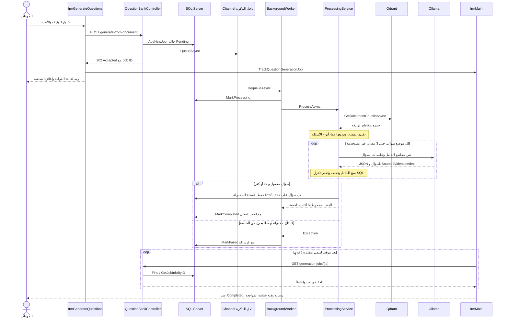

# دليل توليد الأسئلة بالذكاء الاصطناعي في DVLD

هذا الفصل يشرح الكود المحلي الحالي كما قرئ بتاريخ 2026-10-06، بما فيه الملفات المحلية التي قد لا تكون مرفوعة إلى GitHub. هو وصف للتنفيذ الموجود، ولا يعني أن النموذج أو الخدمات أو قاعدة البيانات شُغّلت أثناء إعداد الدليل. جميع الأمثلة أدناه تعليمية ولا تحتوي بيانات مواطنين. أرقام الأسطر مرتبطة بهذه النسخة وقد تتغير عند تعديل الكود لاحقًا.

## 1. الفكرة العامة وما الذي يفعله الـAI

الموظف يختار وثيقة PDF سبق استخراج نصها وتخزين مقاطعها في Qdrant، ثم يحدد عدد أسئلة الاختيار المتعدد وعدد عبارات صح أو خطأ. الـAPI يسجل طلب توليد في SQL Server، يضعه في طابور داخل الذاكرة، ويرجع رقم عملية بدل انتظار توليد الأسئلة. عامل خلفية ينفذ التوليد، ثم تحفظ الأسئلة في `QuestionBank` بحالة `Draft` حتى يراجعها الموظف.

يُستخدم نموذج Ollama لصياغة نص السؤال والخيارات واختيار الإجابة ومقطع الدليل. اختيار المقاطع المناسبة، توزيعها على الصفحات، نسخ الدليل الأصلي، فحص البنية، منع بعض صور التكرار، بناء الشرح، وتسجيل حالة العملية أمور تنفذها شيفرة C#.

هذا الاستخدام لا يدرب نموذجًا جديدًا ولا يغير أوزانه. النموذج الموجود يتلقى تعليمات ونصًا محدودًا من الوثيقة في كل استدعاء. مسار توليد الدفعة يجلب جميع مقاطع وثيقة معينة عبر Qdrant Scroll، ثم يختارها بالقواعد المبينة لاحقًا؛ لا يجري بحث تشابه متجهي بسؤال مستخدم كما يفعل مسار الشات بوت.

## 2. خريطة الملفات والدوال

| المسؤولية | الملف المحلي | الدوال أو الأنواع الأساسية |
|---|---|---|
| شاشة تحديد الوثيقة والعدد وإرسال JSON | [frmGenerateQuestions.cs](<J:/gradeat project/DVLD Project Final/Project/DVLD/QuestionBank/frmGenerateQuestions.cs:46>) | `_LoadReadyDocuments`، `_UpdateTotalQuestions`، `btnGenerate_Click` |
| متابعة الحالة وإشعار اكتمال التوليد | [frmMain.cs](<J:/gradeat project/DVLD Project Final/Project/DVLD/frmMain.cs:50>) | `TrackQuestionGenerationJob`، `_QuestionGenerationTimer_Tick` |
| عرض أحدث أسئلة الوثيقة للمراجعة | [frmManageQuestions.cs](<J:/gradeat project/DVLD Project Final/Project/DVLD/QuestionBank/frmManageQuestions.cs:44>) | `_RefreshQuestionsList`، `btnGenerate_Click` |
| استقبال طلبات التوليد ومتابعة حالتها | [QuestionBankController.cs](<J:/gradeat project/DVLD Project Final/Project/DVLD.Api/QuestionBankController.cs:207>) | `GenerateFromDocument`، `GetGenerationJobStatus`، `GenerateQuestion`، `UpdateReviewStatus` |
| تعريف العملية والطابور | [QuestionGenerationProcessingQueue.cs](<J:/gradeat project/DVLD Project Final/Project/DVLD.Api/Services/QuestionGenerationProcessingQueue.cs:5>) | `QuestionGenerationProcessingJob`، `IQuestionGenerationProcessingQueue`، `QueueAsync`، `DequeueAsync` |
| تشغيل الطلبات الخلفية | [QuestionGenerationBackgroundWorker.cs](<J:/gradeat project/DVLD Project Final/Project/DVLD.Api/Services/QuestionGenerationBackgroundWorker.cs:24>) | `ExecuteAsync` |
| تنسيق مراحل الدفعة والتوليد والحفظ | [QuestionGenerationProcessingService.cs](<J:/gradeat project/DVLD Project Final/Project/DVLD.Api/Services/QuestionGenerationProcessingService.cs:11>) | `ProcessAsync`، `GenerateEvidenceBackedQuestion`، `BuildSourceAttempts`، `BuildQuestionTypes`، `SaveQuestion` |
| جلب مقاطع الوثيقة | [QdrantKnowledgeStore.cs](<J:/gradeat project/DVLD Project Final/Project/DVLD.AI/QdrantKnowledgeStore.cs:103>) | `GetDocumentChunksAsync` |
| تقييم المصادر وتوزيعها | [QuestionSourceSelector.cs](<J:/gradeat project/DVLD Project Final/Project/DVLD.AI/QuestionSourceSelector.cs:50>) | `SelectBestSources`، `EvaluateChunk`، `CalculateQualityScore`، `CalculateExamValueScore`، `SelectDistributedCandidates`، `SelectWeightedCandidate` |
| الطلب الفعلي إلى Ollama | [OllamaQuestionGeneratorService.cs](<J:/gradeat project/DVLD Project Final/Project/DVLD.AI/OllamaQuestionGeneratorService.cs:59>) | `GenerateQuestionAsync`، `BuildEvidenceSegments`، `BuildSystemPrompt`، `ResolveSourceEvidence`، `ValidateGeneratedQuestion`، `BuildDeterministicExplanation` |
| فحص الدليل بقواعد ثابتة | [QuestionEvidenceValidator.cs](<J:/gradeat project/DVLD Project Final/Project/DVLD.AI/QuestionEvidenceValidator.cs:74>) | `Validate`، `NormalizeForComparison` |
| طبقة Business لعملية التوليد | [clsQuestionGenerationJob.cs](<J:/gradeat project/DVLD Project Final/Project/DVLD_Buisness/clsQuestionGenerationJob.cs:73>) | `Find`، `AddNewJob`، `MarkProcessing`، `MarkCompleted`، `MarkFailed` |
| SQL لحالة العملية | [clsQuestionGenerationJobData.cs](<J:/gradeat project/DVLD Project Final/Project/DVLD_DataAccess/clsQuestionGenerationJobData.cs:9>) | `AddNewJob`، `MarkProcessing`، `MarkCompleted`، `MarkFailed`، `GetJobInfoByID` |
| Business للأسئلة | [clsQuestionBank.cs](<J:/gradeat project/DVLD Project Final/Project/DVLD_Buisness/clsQuestionBank.cs:350>) | `AddNewQuestion`، `IsDuplicateQuestion`، `Approve`، `Reject` |
| SQL للأسئلة | [clsQuestionBankData.cs](<J:/gradeat project/DVLD Project Final/Project/DVLD_DataAccess/clsQuestionBankData.cs:9>) | `AddNewQuestion`، `IsDuplicateQuestion`، `UpdateReviewStatus` |
| تسجيل الخدمات عند بدء الـAPI | [Program.cs](<J:/gradeat project/DVLD Project Final/Project/DVLD.Api/Program.cs:13>) | `AddSingleton<IQuestionGenerationProcessingQueue, QuestionGenerationProcessingQueue>`، `AddHostedService<QuestionGenerationBackgroundWorker>` |

## 3. المسار الكامل من الشاشة إلى قاعدة البيانات



## 4. شاشة التوليد وما الذي ترسله

الدالة `_LoadReadyDocuments` تستعمل `clsKnowledgeDocument.GetActiveReadyDocumentIDs`، ثم `clsKnowledgeDocument.Find` لتجهيز `cmbDocuments`. تعرض `OriginalFileName` وتحمل `DocumentID` في `SelectedValue`.

الدالة `_UpdateTotalQuestions` تجمع قيم `nudMultipleChoice` و`nudTrueFalse` وتحدث `lblTotalQuestions`. تعطّل الزر إذا تجاوز المجموع 100، وتفعله إذا كان المجموع أكبر من صفر وهناك وثائق في القائمة. حدث `frmGenerateQuestions_Load` يضبط الحد الأعلى لكل حقل عدد على 100، ثم يحمل الوثائق ويحسب المجموع.

في [btnGenerate_Click](<J:/gradeat project/DVLD Project Final/Project/DVLD/QuestionBank/frmGenerateQuestions.cs:137>) تتكون البيانات بهذا الشكل:

```json
{
  "documentID": 10,
  "multipleChoiceCount": 6,
  "trueFalseCount": 4
}
```

تُسلسل بواسطة `System.Text.Json.JsonSerializer.Serialize`، ثم ترسل بواسطة `StringContent` مع UTF-8 و`application/json` إلى:

```text
POST https://localhost:7077/api/question-bank/generate-from-document
```

مهلة طلب الشاشة 30 ثانية. هذه مهلة تسجيل الطلب وإدخاله في الطابور، وليست مهلة توليد الدفعة. بعد قراءة الرد، يفك JSON إلى `GenerateQuestionsResponse` باستخدام `PropertyNameCaseInsensitive = true`. إذا وجد رقم عملية صالحًا، يمرره إلى `frmMain.TrackQuestionGenerationJob`، يعرض رسالة البدء، ثم يغلق شاشة التوليد.

الوضع الحالي مهم للشرح: لا يوجد `try/catch` حول هذا الإرسال في الحدث، ولا فحص `response.IsSuccessStatusCode` قبل فك الرد، ولا تعطيل للزر أثناء انتظار الطلب. فحص رقم العملية موجود، لكن أخطاء النقل أو JSON غير المتوقع قد تحدث قبل الوصول إليه. هذه حدود التنفيذ الموجود، وليست تعديلات نفذت ضمن الدليل.

## 5. الـAPI: قبول طلب خلفي وليس إرجاع الأسئلة فورًا

`QuestionBankController.GenerateFromDocument` يفحص:

1. وجود كائن الطلب.
2. أن `DocumentID` أكبر من صفر.
3. ألا يكون أي عدد سالبًا.
4. أن مجموع العددين من 1 إلى 100.
5. أن `GetFilePathByDocumentID` يرجع مسارًا، وأن ملف PDF موجود على القرص.

تصفية الوثائق `Active + Ready` موجودة في شاشة التوليد. الـendpoint نفسه لا يفحص هاتين الحالتين صراحة، ولا يفحص وجود المقاطع أو كفاية مصادر التوليد قبل القبول؛ هذه الفحوص اللاحقة تحدث في العامل الخلفي.

بعد التحقق، يستدعي `clsQuestionGenerationJob.AddNewJob`. ثم ينشئ `QuestionGenerationProcessingJob` ويحمل فيه أربعة أرقام: معرف العملية، معرف الوثيقة، عدد الاختيار المتعدد، وعدد صح/خطأ. يدخله إلى `_questionGenerationQueue.QueueAsync`.

الرد، مع سياسة JSON الافتراضية المعتادة لـASP.NET Core، يحتوي الحقول التالية:

```json
{
  "questionGenerationJobID": 3,
  "documentID": 10,
  "multipleChoiceCount": 6,
  "trueFalseCount": 4,
  "totalQuestions": 10,
  "status": "Pending",
  "message": "Question generation started in the background."
}
```

كود `Accepted(...)` يعني HTTP 202. القبول يعني أن الطلب سجل وأدخل في الطابور، ولا يضمن أن توليد العدد المطلوب سينجح. يمكن أن يظل الرد الأول `Pending` بينما العامل بدأ فعليًا؛ معرفة الحالة الحالية تأتي من endpoint المتابعة.

إذا فشل التسجيل أو الإدخال في الطابور، يرجع الـController خطأ 500 برسالة عامة، ويحاول وضع العملية المسجلة في `Failed`. أخطاء الحصول على مسار الوثيقة الواقعة خارج هذا الجزء يمكن أن تصل إلى معالج الأخطاء المركزي.

## 6. الطابور والعامل الخلفي وحالة العملية

### 6.1 الطابور

[QuestionGenerationProcessingQueue](<J:/gradeat project/DVLD Project Final/Project/DVLD.Api/Services/QuestionGenerationProcessingQueue.cs:55>) يستعمل `Channel<QuestionGenerationProcessingJob>` بسعة **100 عملية**:

- `FullMode = Wait`: إذا امتلأ، ينتظر إدخال الطلب حتى تتوفر مساحة.
- `SingleReader = true`: مصمم لقارئ واحد.
- `SingleWriter = false`: يسمح بأكثر من جهة كتابة.
- `QueueAsync` ترفض `null` وتستعمل `WriteAsync`.
- `DequeueAsync` تستعمل `ReadAsync` مع cancellation token.

سعة الطابور 100 عملية تختلف عن حد 100 سؤال داخل العملية الواحدة. الخدمة مسجلة Singleton؛ الـController والعامل يستخدمان الطابور نفسه خلال عمر عملية الـAPI.

### 6.2 العامل

`QuestionGenerationBackgroundWorker.ExecuteAsync` يكرر السحب من الطابور. بعد السحب:

1. يستدعي `MarkProcessing`، ويتأكد أن تحديث الحالة نجح.
2. يسجل بداية العمل في logger.
3. ينتظر `QuestionGenerationProcessingService.ProcessAsync`.
4. يستدعي `MarkCompleted` مع العدد الفعلي الذي أعادته الخدمة.
5. إذا خرج أي استثناء من الخطوات السابقة، يحاول `MarkFailed` ويكتب سجل الخطأ.

العمليات تنفذ بالتتابع بواسطة هذا العامل؛ والكود داخل `ProcessAsync` ينتظر توليد سؤال قبل الانتقال إلى التالي. الخلفية تسمح للواجهة باستكمال العمل، لكنها لا تجعل استدلال النموذج أسرع بحد ذاتها.

Cancellation token يمر إلى انتظار سحب العملية فقط. `ProcessAsync` وطلب Ollama لا يستقبلانه من العامل. لا توجد هنا آلية إلغاء دفعة من الواجهة أو إعادة تشغيل تلقائي للدفعة بعد فشلها.

### 6.3 SQL وحالات العملية

`clsQuestionGenerationJob` يحمل البيانات ويمرر عمليات القراءة والتحديث إلى `clsQuestionGenerationJobData`. الاستعلامات تستعمل `SqlConnection` و`SqlCommand` بمعاملات محددة النوع.

| الحالة | عملية SQL الحالية | المعنى |
|---|---|---|
| `Pending` | `AddNewJob`: INSERT في `QuestionGenerationJobs` و`RequestedAt = SYSDATETIME()` ثم `SCOPE_IDENTITY()` | سجل طلب ينتظر التنفيذ |
| `Processing` | `MarkProcessing`: تحديث الحالة و`StartedAt` وإفراغ `FinishedAt` و`ErrorMessage` | العامل بدأ تنفيذ الطلب |
| `Completed` | `MarkCompleted`: الحالة و`FinishedAt` والعدد الفعلي، وإفراغ الخطأ | خدمة التوليد أعادت نتائج وحفظتها دون خروج خطأ |
| `Failed` | `MarkFailed`: الحالة و`FinishedAt` و`ErrorMessage` | خطأ خرج إلى العامل؛ لا يعني بالضرورة أن صفر أسئلة حفظت |

`GET /api/question-bank/generation-jobs/{questionGenerationJobID}` تنفذه [GetGenerationJobStatus](<J:/gradeat project/DVLD Project Final/Project/DVLD.Api/QuestionBankController.cs:382>). يفحص المعرف، يستدعي `clsQuestionGenerationJob.Find` ثم `GetJobInfoByID`، ويرجع أعداد الطلب والحالة والأوقات و`GeneratedQuestionsCount` و`ErrorMessage`. الأوقات والعدد يمكن أن تكون `null` قبل الوصول إلى مراحلها. لا توجد نسبة تقدم تفصيلية أو تحديث لعدد الأسئلة بعد كل سؤال.

وجود الاستعلامات يثبت متطلبات الجدول من جهة الكود. لم يُفحص المخطط الحي أو backup أثناء هذا الفصل، فلا يثبت وحده القيم الافتراضية أو القيود الفعلية للجدول في كل بيئة.

## 7. جلب المقاطع واختيار مصادر الأسئلة

### 7.1 المقاطع المطلوبة

`ProcessAsync` يعيد فحص المجموع، ثم مسار الوثيقة ووجود الملف. يجلب المقاطع من `QdrantKnowledgeStore.GetDocumentChunksAsync(documentID)`.

دالة Qdrant تستخدم `ScrollAsync` مع فلتر `document_id`، وحد كل صفحة نتائج 100 نقطة، وتتابع `NextPageOffset` حتى النهاية. تقرأ من payload الحقول `text` و`page_number` و`chunk_index`. تتجاوز النقاط التي ينقصها أي من هذه الحقول، ثم ترتب النتيجة بحسب `ChunkIndex`.

إذا لم توجد مقاطع، تفشل الدفعة. `totalPages` الذي يُرسل إلى اختيار المصادر هو أكبر `PageNumber` بين المقاطع المسترجعة، وليس قراءة جديدة لعدد صفحات الـPDF؛ لذلك هو نطاق الصفحات الممثلة بالمقاطع.

### 7.2 صلاحية كل Chunk

`QuestionSourceSelector.EvaluateChunk` ينشئ `QuestionSourceCandidate` يحوي النص ودرجات الجودة والقيمة الاختبارية ومؤشرات العربية والضجيج وسبب الرفض. الاختيار لا يعتمد على أول مقطع فقط.

الفحوص الأساسية في هذه النسخة:

| الفحص | شرط القبول |
|---|---|
| النص | غير فارغ، وطوله بعد Trim لا يقل عن 250 حرفًا |
| المحتوى المستبعد | لا يحتوي مؤشرات عامة للفهرس والمراجع والروابط وISBN |
| الحروف المقروءة | لا يقل `LetterCount` عن 80 |
| العربية | نسبة الحروف العربية من إجمالي الحروف لا تقل عن 0.10 |
| الضجيج | نسبة الرموز غير العادية من طول النص لا تزيد على 0.45 |
| الجودة | `QualityScore >= 45` |
| القيمة الاختبارية | `ExamValueScore >= 20` |

النسب مبنية على عد الحروف والرموز في `AnalyzeText`، وليست احتمالات تعلم آلي ولا تقديرات ثقة من النموذج. `ContainsExcludedContent` يبحث عن substring لمؤشرات مثل «الفهرس» و«المراجع» و`https://`؛ ظهور المؤشر داخل فقرة سليمة قد يستبعدها أيضًا، لأن الفحص قاعدي.

### 7.3 درجة جودة النص

[CalculateQualityScore](<J:/gradeat project/DVLD Project Final/Project/DVLD.AI/QuestionSourceSelector.cs:584>) تجمع نقاطًا ثم تقيد النتيجة بين 0 و100:

- الطول: 25 نقطة لطول من 450 إلى 1500، وإلا 18 لطول من 300 إلى 2000، وإلا 10.
- نسبة العربية: 30 نقطة عند 0.50 أو أكثر، 24 عند 0.30، 18 عند 0.20، وإلا 10.
- علامات الجمل: 15 نقطة إذا كان العدد 3 أو أكثر، وإلا 10 عند وجود علامة واحدة أو أكثر.
- خصم `NoiseRatio × 30`.
- خصم `PresentationFormRatio × 25` لمؤشر Arabic Presentation Forms.
- خصم 15 إذا تجاوزت نسبة الأرقام 0.20، وإلا 7 إذا تجاوزت 0.10.

هذه الدرجة تقيس قابلية النص للاستخدام وفق قواعد المشروع، ولا تحكم على صحة المعلومات.

### 7.4 القيمة الاختبارية

[CalculateExamValueScore](<J:/gradeat project/DVLD Project Final/Project/DVLD.AI/QuestionSourceSelector.cs:268>) تطبع النص بـFormKC وlowercase وتوحيد بعض صور الحروف العربية وإزالة التطويل. ثم تبحث عن مؤشرات عامة لقواعد وتعريفات وشروط وإجراءات وأرقام.

| مجموعة المؤشرات | وزن كل مؤشر موجود | الحد الأقصى للمجموعة |
|---|---:|---:|
| متطلبات ومنع: يجب، يشترط، لا يجوز… | 14 | 28 |
| شروط: إذا، في حال، عندما… | 10 | 20 |
| تعريفات: يقصد بـ، يعني، عبارة عن… | 14 | 24 |
| إجراء وتسلسل: أولًا، ثم، الخطوة… | 7 | 21 |
| حدود كمية: على الأقل، لا يزيد، حد أقصى… | 12 | 24 |
| وجود رقم | إضافة واحدة 10 | 10 |
| استثناء وسبب ونتيجة | 8 | 16 |
| جملة معلوماتية: طول 35 أو أكثر و7 كلمات/أرقام أو أكثر | 3 | 12 |

الناتج يقيد بين 0 و100. `CountMarkerGroups` يعد المؤشرات المختلفة الموجودة، ولا يعد كل تكرارات الكلمة نفسها. لا توجد مطابقة دلالية تعلمية هنا.

### 7.5 إزالة بعض المصادر المكررة

`SelectBestSources` يرتب المناسبين أولًا بحسب `ExamValueScore` ثم `QualityScore`. يستدعي `RemoveDuplicateCandidates`، الذي يبني مفتاحًا من أول **250 حرفًا أو رقمًا** بعد حذف المسافات والترقيم وتحويل الحروف إلى lowercase. إذا تساوى المفتاح، يحتفظ بالمرشح الأعلى في القيمة الاختبارية ثم الجودة.

هذا تطابق لمقدمة مطبعة من المقطع؛ لا يثبت وجود خوارزمية تشابه دلالي عامة. يمكن لمقطعين مختلفين بعد أول 250 حرفًا أن يعاملا كمصدر واحد. وإذا كان عدد المصادر بعد هذه التصفية أقل من عدد الأسئلة المطلوب، ترمي الدالة خطأ قبل بدء التوليد؛ لا تخفض العدد تلقائيًا في مرحلة اختيار المصادر.

### 7.6 توزيع الصفحات والاختيار الموزون

`SelectDistributedCandidates` يقسم نطاق الصفحات إلى مناطق نسبية بعدد الأسئلة المطلوبة. لكل منطقة يحاول اختيار Chunk لم يستخدم وصفحته لم تستخدم، ثم يسمح بصفحة مستخدمة لكن Chunk مختلف إذا لم يجد. إذا بقي نقص، يكمله من أفضل المرشحين غير المستخدمين في الوثيقة. أخيرًا يرتب المصادر المختارة بحسب الصفحة.

داخل المنطقة، [SelectWeightedCandidate](<J:/gradeat project/DVLD Project Final/Project/DVLD.AI/QuestionSourceSelector.cs:950>) لا يختار من كل النصوص عشوائيًا:

1. يأخذ أول 12 مرشحًا من القائمة المرتبة.
2. يحتفظ بمن لا تبعد قيمته الاختبارية عن الأفضل أكثر من 12 نقطة.
3. يعطي كل مرشح وزنًا: `max(1, 2 × ExamValueScore + QualityScore)`.
4. يستخدم `Random.Shared.NextDouble` للاختيار حسب مجموع الأوزان.

النتيجة تنوع بين المصادر القوية بدل تكرار المصدر الأول. لا يضمن ذلك تغطية كل موضوع أو كل فصل، لأن التقسيم حسب الصفحات والجودة، ولا توجد فهرسة موضوعات دلالية في هذه الخوارزمية.

## 8. توزيع أنواع الأسئلة ومحاولات المصادر

[BuildQuestionTypes](<J:/gradeat project/DVLD Project Final/Project/DVLD.Api/Services/QuestionGenerationProcessingService.cs:430>) يوزع صح/خطأ بين الاختيار المتعدد وفق:

```text
expectedTrueFalse = floor((i + 1) × trueFalseCount / total)
```

إذا تجاوز العدد المتوقع ما أضيف بالفعل، يضع `TrueFalse`، وإلا `MultipleChoice`. مثال 6 اختيار متعدد و4 صح/خطأ يعطي مواضع الأنواع:

```text
MC, MC, TF, MC, TF, MC, MC, TF, MC, TF
```

هذا توزيع قبل التوليد. إذا فشلت بعض المواضع، قد تختلف نسب أنواع النتائج النهائية عن الطلب، لأن الموضع الذي يفشل لا يعوض بسؤال من النوع نفسه لاحقًا.

لكل موضع، `BuildSourceAttempts` يجهز حتى **3 مصادر** وفق القيمة الفعلية لـ`MaxSourceAttemptsPerQuestion = 3`:

- المصدر الأساسي إذا لم يستعمل.
- بدائل مناسبة لم تستعمل، مع تفضيل صفحة مختلفة عن صفحة المصدر الأساسي، ثم أعلى قيمة اختبارية وأعلى جودة.
- يستبعد تكرار `ChunkIndex` داخل قائمة المحاولات.

كل مصدر يضاف إلى `usedChunkIndexes` **قبل** استدعاء النموذج، حتى إن فشل التوليد أو التحقق. هذا يمنع إعادة استخدامه في بقية الدفعة. القائمة العامة للبدائل تبنى من `EvaluateChunk` دون استدعاء `RemoveDuplicateCandidates` مرة ثانية؛ لذلك إزالة مصادر متشابهة ليست مطبقة بالطريقة نفسها على كل بديل.

لا يوجد retry لإصلاح JSON بنفس المصدر داخل `GenerateQuestionAsync`. عند فشل المحاولة، تسجل الخدمة آخر رسالة خطأ وتجرب مصدرًا بديلًا. بعض التعليقات في الـController تذكر «بديل واحد»، لكن الثابت العامل فعليًا في خدمة الخلفية يحدد الحد إلى 3 مصادر؛ التوثيق هنا يعتمد السلوك البرمجي.

## 9. تفاصيل الطلب إلى Ollama

### 9.1 الإعدادات الحالية

في [OllamaQuestionGeneratorService](<J:/gradeat project/DVLD Project Final/Project/DVLD.AI/OllamaQuestionGeneratorService.cs:45>):

| الإعداد | القيمة |
|---|---|
| Endpoint | `http://localhost:11434/api/chat` |
| اسم النموذج | `qwen3:1.7b` |
| مهلة HttpClient | 5 دقائق للاستدعاء |
| `stream` | `false` |
| `think` | `false` |
| `format` | `json` |
| `num_ctx` | 2048 |
| `num_predict` | 320 |
| `temperature` | 0.1 |

هذه إعدادات إرسال موجودة بالكود؛ لم يفحص تشغيل Ollama أو وجود النموذج أو استهلاك CPU/GPU. الحرارة المنخفضة تهدف إلى صياغة أكثر استقرارًا، لكنها لا تضمن صحة الإجابة أو ثبات كل نتيجة. مهلة 5 دقائق سقف انتظار وليست زمن التوليد المعتاد.

### 9.2 تجهيز الأدلة المرقمة

`BuildEvidenceSegments` تقسم النص إلى مقاطع جمل عند النقطة وعلامات السؤال والتعجب والفاصلة المنقوطة والأسطر. تحمي النقطة بين رقمين قبل التقسيم حتى يبقى مثل `6.0` و`3.5` في مقطع واحد، ثم تعيدها إلى صورتها الأصلية.

`IsSuitableEvidenceSegment` يشترط طولًا لا يقل عن 25، وعدد مجموعات كلمات عربية لا يقل عن 5. ويرفض نهاية تشبه مقدمة قائمة تنتهي بنقطتين، أو نهاية بحرف/كلمة مثل «في» و«من» و«إلى» و«على»، باعتبارها إشارة إلى عبارة مبتورة. المقاطع المقبولة ترقم في `BuildNumberedSource` بدءًا من صفر:

```text
[E0] مقطع الدليل الأول من الوثيقة.
[E1] مقطع الدليل الثاني من الوثيقة.
```

إذا لم يتبق مقطع صالح، تفشل هذه المحاولة قبل الوصول إلى Ollama. بعض قواعد «الكلمات العربية» تعتمد Regex على نطاق Unicode عربي، فلا تمثل محللًا لغويًا كاملًا.

### 9.3 الـPrompt وناتج النموذج

`BuildSystemPrompt` يختلف حسب النوع. في صح/خطأ، يطلب عبارة تقريرية لا سؤالًا، وخيارين «صح» و«خطأ»، وإجابة A أو B. في الاختيار المتعدد، يطلب أربعة خيارات عربية وإجابة واحدة محددة، ومعلومة واضحة من مصدر واحد. `userPrompt` يعرض المقاطع المرقمة ويمنع المعرفة الخارجية ونسخ التعليمات وMarkdown.

النموذج لا يُطلب منه نسخ الدليل أو إنشاء الشرح. يُطلب منه اختيار `SourceEvidenceIndex` فقط. شكل الناتج المقصود للاختيار المتعدد:

```json
{
  "questionText": "نص سؤال مستخرج من المعلومة",
  "questionType": "MultipleChoice",
  "optionA": "الخيار الأول",
  "optionB": "الخيار الثاني",
  "optionC": "الخيار الثالث",
  "optionD": "الخيار الرابع",
  "correctOption": "B",
  "sourceEvidenceIndex": 0
}
```

`PostAsJsonAsync` يرسل الطلب. `EnsureSuccessStatusCode` يفشل الاستدعاء عند رد HTTP غير ناجح. تُقرأ طبقة رد Ollama الخارجية بـ`JsonDocument`، ثم الحقل `message.content`، ثم يفك النص الداخلي إلى `GeneratedQuestion` بـ`JsonSerializer.Deserialize` مع عدم حساسية حالة الأحرف في أسماء الحقول.

لا توجد إزالة code fences أو استخلاص JSON من نص زائد أو JSON repair في هذا المسار. إذا أعاد النموذج JSON غير صالح أو حقولًا غير مناسبة، تفشل المحاولة ويعود الأمر إلى بدائل المصادر في الخدمة.

### 9.4 من أين يأتي SourceEvidence؟

`ResolveSourceEvidence` يتحقق أن الفهرس ضمن `evidenceSegments`، ثم ينسخ النص من القائمة المحلية إلى `question.SourceEvidence`. لذلك المرجع المحفوظ ليس إعادة صياغة أو اقتباسًا أنشأه النموذج، بل مقطع من النص المستخرج الذي قدمته الشيفرة.

الفهرس `SourceEvidenceIndex` محلي لقائمة الأدلة الخاصة بالـChunk، ويبدأ من الصفر. أما `SourceChunkIndex` فهو معرف ترتيب المقطع داخل الوثيقة، و`SourcePageNumber` هو رقم صفحة الـPDF. ليست هذه القيم الثلاث interchangeable.

## 10. التحقق من السؤال والدليل: ما الذي يثبته وما الذي لا يثبته

### 10.1 بنية السؤال

`ValidateGeneratedQuestion` تقوم بـTrim، وتثبت `QuestionType` حسب النوع المطلوب، وتطبع الإجابة الصحيحة. `NormalizeCorrectOption` تقبل مثلًا حرفًا صغيرًا أو `OptionB` بعد إزالة المسافات وبعض الفواصل وإرجاع B.

تفحص:

- وجود نص السؤال ووجود محتوى عربي فيه.
- عدم احتوائه تعليمات prompt أو أسماء حقول أو مراجع `[E0]`.
- وجود دليل كافٍ بعد نسخه.
- صح/خطأ: العبارة لا تبدأ بأدوات استفهام معروفة ولا تنتهي بعلامة سؤال؛ تثبت الخيارين «صح» و«خطأ» وتفرغ C وD؛ الإجابة A أو B.
- اختيار متعدد: أربعة خيارات غير فارغة، تحتوي عربية، ولا تحتوي حروفًا من خارج النطاقات العربية التي يفحصها الكود.
- عدم تطابق الخيارات الأربعة بعد إزالة مسافات وبعض علامات الترقيم.
- الإجابة الصحيحة A أو B أو C أو D.

فحص الحروف الأجنبية مطبق على خيارات الاختيار المتعدد؛ لا يعني أن كل نص السؤال خضع لفحص نحوي أو منع شامل لكل حرف أجنبي. والفحوص لا تثبت أن هناك إجابة واحدة صحيحة دلاليًا من بين الخيارات.

`PrepareAndValidateQuestion` في خدمة الخلفية يعيد فحص البنية الأساسية ويثبت شكل صح/خطأ مرة أخرى. هذا تحقق إضافي بالقواعد وليس استدعاء نموذج آخر.

### 10.2 الدليل الحتمي

[QuestionEvidenceValidator.Validate](<J:/gradeat project/DVLD Project Final/Project/DVLD.AI/QuestionEvidenceValidator.cs:74>) تنفذ قواعد لا تحتاج Ollama:

1. النص والدليل غير فارغين.
2. تطبيع Unicode بـFormKC وإزالة التطويل وتوحيد whitespace وبعض المسافات الخاصة.
3. طول الدليل المطبّع 25 أو أكثر.
4. وجود الدليل كاملًا كـsubstring داخل الـChunk المطبّع.
5. 5 مجموعات كلمات عربية أو أكثر.
6. عدم انتهاء الدليل بكلمات تدل على عبارة ناقصة.
7. 3 كلمات عربية مميزة معلوماتية أو أكثر، بطول 3 فأكثر وغير موجودة بقائمة stop words.
8. نسبة الحروف العربية المحسوبة إلى طول الدليل لا تقل عن 0.45.

إذا فشل شرط، ترجع `IsValid = false` و`FailureReason`، ثم ترمي خدمة التوليد استثناءً وتنتقل لمصدر بديل. نجاح الفحص يثبت أن الدليل موجود ومقروء نسبيًا. **لا يفحص العلاقة الدلالية بين السؤال والإجابة الصحيحة والدليل**؛ يمكن نظريًا أن يختار النموذج إجابة خاطئة ويشير إلى مقطع حقيقي. لهذا تحفظ النتيجة `Draft` للمراجعة البشرية.

### 10.3 الشرح يُبنى في التطبيق

بعد التحقق، [BuildDeterministicExplanation](<J:/gradeat project/DVLD Project Final/Project/DVLD.AI/OllamaQuestionGeneratorService.cs:688>) تنشئ:

```text
الإجابة الصحيحة هي [نص الخيار أو صح/خطأ]. الدليل: [المقطع الأصلي].
```

هناك `SanitizeExplanation` لتنظيف نص شرح إن أعاده النموذج، لكن `GenerateQuestionAsync` يستبدله بعد ذلك بالشرح الحتمي. النتيجة أن الشرح النهائي لا يضيف تفسيرًا مستقلًا أنشأه النموذج؛ يذكر الإجابة المختارة والدليل. صحته الدلالية تظل مرتبطة بصحة الإجابة التي اختارها النموذج ومراجعة الموظف.

### 10.4 Validator موجود ولكنه غير مستخدم

يوجد [OllamaQuestionGroundingValidatorService.cs](<J:/gradeat project/DVLD Project Final/Project/DVLD.AI/OllamaQuestionGroundingValidatorService.cs:55>) بدالة `ValidateAsync` تطلب من النموذج تقييم grounding ودعم الإجابة والشرح واللغة ووحدة الإجابة. `IsAccepted` يشترط جميع القيم المنطقية، و`GroundingScore >= 80` و`LanguageQualityScore >= 70`.

البحث في ملفات التطبيق المحلية لم يجد استدعاءً لهذه الخدمة من مسارات التوليد الحالية. لذلك لا يصح وصف المشروع بأنه ينفذ مراجعة لغوية ودلالية مستقلة من نموذج ثانٍ أو من استدعاء تقييم بعد كل سؤال. الموجود النشط هو validator الحتمي وفحص البنية والمراجعة البشرية.

## 11. فحص التكرار والحفظ Draft

بعد الحصول على السؤال والدليل، `ProcessAsync` تستدعي `clsQuestionBank.IsDuplicateQuestion`، التي تمرر إلى [clsQuestionBankData.IsDuplicateQuestion](<J:/gradeat project/DVLD Project Final/Project/DVLD_DataAccess/clsQuestionBankData.cs:192>).

SQL يعتبره مكررًا إذا وجد في الوثيقة نفسها سؤال فعال وغير `Rejected` يحقق أحد الشرطين:

- نص سؤال مساوٍ بعد `LTRIM/RTRIM`.
- أو `SourceEvidence` مساوٍ بعد `LTRIM/RTRIM`.

الأعمدة `NULL` لها معالجة صريحة في فلتر الوثيقة؛ مقارنة SQL النصية تتأثر أيضًا بالـcollation الفعلي، الذي لم يُفحص من قاعدة البيانات. هذا ليس كشف إعادة صياغة بمعاني متشابهة أو embedding similarity. الأسئلة المرفوضة أو المعطلة لا تمنع توليد سؤال جديد من المصدر ذاته.

السؤال المقبول يدخل `pendingQuestions`، مع الصفحة والـChunk. لا تحفظ الأسئلة فور قبول كل واحد؛ يجمعها الكود حتى نهاية حلقة التوليد، ثم `SaveQuestion` تستدعي `clsQuestionBank.AddNewQuestion` وصولًا إلى `clsQuestionBankData.AddNewQuestion`.

يحفظ SQL:

- نص السؤال ونوعه والخيارات والإجابة الصحيحة والشرح.
- `SourceDocumentID` و`SourcePageNumber`.
- `SourceEvidence` و`SourceChunkIndex`.
- `ReviewStatus = Draft`.

`SourceEvidenceIndex` لا يُرسل ضمن INSERT. لا يُحفظ `QuestionGenerationJobID` ضمن السؤال في هذا التنفيذ، ولا يرجع endpoint المتابعة قائمة Question IDs. درجات `QualityScore` و`ExamValueScore` ونتيجة validator التفصيلية أيضًا لا تُحفظ ضمن INSERT الحالي.

كل INSERT يستخدم connection/command مستقلين و`SCOPE_IDENTITY` ومعاملات SQL محددة النوع. `OptionC` و`OptionD` الفارغان في صح/خطأ يحفظان `NULL`. لا يشمل هذا INSERT صراحة `CreatedAt` أو `IsActive`؛ تعتمد قيم البداية على مخطط قاعدة البيانات، فلا ينبغي نسب إعدادها إلى هذه الدالة.

ملاحظة تكرار مهمة: فحص التكرار يجري ضد الأسئلة المحفوظة في SQL قبل حفظ الدفعة. لا توجد مقارنة مستقلة لكل سؤال جديد مع باقي `pendingQuestions`، ولا قيد فريد أو transaction ظاهر في هذا المسار يثبت منع كل تكرار داخل الدفعة أو عند المنافسة بين عمليات متعددة. عدم إعادة استعمال الـChunk يقلل التكرار لكنه لا يضمن غيابه بين Chunks مختلفة.

حالة السؤال `Draft / Approved / Rejected` تختلف عن حالة عملية التوليد `Pending / Processing / Completed / Failed`. الـAPI يسمح بتعديل المراجعة عبر `PATCH /api/question-bank/{questionID}/review-status` إلى `Approved` أو `Rejected`؛ شاشة الموظف تعرض الدليل ليقرر الاعتماد. نجاح التوليد لا يعني اعتماد الأسئلة تلقائيًا.

## 12. النتائج الجزئية والفشل وإعادة التشغيل

### 12.1 نجاح جزئي

إذا فشل سؤال في جميع مصادره، تستمر الحلقة إلى الموضع التالي. عند وجود سؤال مقبول واحد أو أكثر، يحفظهم الكود ويرجع عددهم، ثم يضع العامل العملية في `Completed` حتى لو كان أقل من العدد المطلوب. مثال تعليمي: طلب 10 أسئلة ونجح 7؛ يمكن أن ترجع المتابعة `Completed` و`GeneratedQuestionsCount = 7` مع بقاء `TotalQuestions = 10`.

لا توجد حالة `PartiallyCompleted`، ولا تفاصيل فشل لكل موضع، ولا استكمال تلقائي للوصول إلى 10. آخر خطأ يدرج ضمن رسالة الفشل فقط إذا كان عدد المقبولين صفرًا. لذلك الدليل والعرض يجب أن يفرقا بين العدد المطلوب والعدد الفعلي.

### 12.2 فشل حفظ أو تحديث الحالة

لا توجد transaction تشمل حفظ كل أسئلة الدفعة. إذا نجح حفظ أول أسئلة ثم فشل سؤال لاحق، يبقى ما حفظ في القاعدة وتصل العملية إلى `Failed` إن نجح تحديث حالتها. `MarkFailed` لا يسجل عدد ما حفظ، فلا يثبت العدد `null` أو الحالة `Failed` أن القاعدة خالية من نواتج تلك المحاولة.

كذلك قد تنتهي جميع INSERTs ثم يفشل `MarkCompleted`؛ عندها يحاول العامل `MarkFailed` رغم وجود النتائج. وإذا فشل تحديث الحالة إلى `Failed` نفسه، يكتب logger الخطأ، ويمكن أن تبقى الحالة القديمة في SQL.

### 12.3 Restart

الطابور داخل الذاكرة وليس جدولًا يستعلم عنه العامل عند بدء التشغيل. سجل الحالة دائم في SQL، لكن لم توجد في العامل الحالي إعادة تحميل الطلبات `Pending` أو `Processing` بعد restart. إذا أغلق الـAPI، قد تضيع طلبات الطابور وتبقى حالة السجل معلقة. أما إغلاق شاشة التوليد بعد إرسال الطلب فلا يلغي العملية طالما استمر الـAPI.

متابعة واجهة Desktop نفسها تخزن رقم Job واحدًا في حقل داخل `frmMain` دون استرجاعه من SQL عند إعادة تشغيل التطبيق. استبدال الرقم بتتبع طلب ثانٍ يوقف متابعة الأول من جهة الواجهة، مع أن العامل قد ينفذه.

### 12.4 الوقت والموارد

من الكود يمكن الاستنتاج أن زمن الدفعة يتراكم من استدعاءات Ollama المتتابعة وعدد البدائل، واستعلامات SQL وجلب Qdrant. الحد النظري لقائمة المصادر ثلاثة لكل موضع، لكن الاستدعاءات الفعلية قد تقل بسبب نفاد المصادر أو رفض الدليل قبل الشبكة. لا يوجد قياس CPU أو GPU أو tokens فعلي أو benchmark في هذه المراجعة، لذلك لا يعطي هذا الدليل نسب أداء أو زمنًا ثابتًا.

## 13. Notification ومتابعة النتيجة على الكمبيوتر

`TrackQuestionGenerationJob` يحفظ رقم العملية ويبدأ `_QuestionGenerationTimer`. المؤقت ينشأ في constructor الخاص بـ`frmMain` بفاصل `5000` ms.

حدث `_QuestionGenerationTimer_Tick` يوقف المؤقت أثناء قراءة الـAPI لتقليل تداخل طلبات المتابعة، ويستخدم مهلة 30 ثانية. عند `Pending` أو `Processing` يعيد تشغيل المؤقت. عند رد غير ناجح أو exception يعيد المحاولة بعد بدء المؤقت مجددًا. لهذا 5 ثوانٍ هي مهلة المؤقت بعد إعادة تشغيله؛ الفاصل الفعلي بين الاستعلامات يتضمن أيضًا زمن الاستجابة.

عند `Completed` يعرض `MessageBox` بالعدد الفعلي، ثم يفتح `frmManageQuestions(this, documentID, generatedQuestionsCount)` باستخدام `ShowDialog`. هذا إشعار داخل التطبيق، وليس Push للموبايل أو Windows Toast أو NotifyIcon.

الحدود الحالية:

- يتابع Job واحدًا فقط.
- `Failed` لا يعرض `ErrorMessage` للمستخدم؛ يصل إلى مسح رقم التتبع دون رسالة فشل.
- شاشة النتائج تستعمل `_RefreshQuestionsList` لتصفية `SourceDocumentID` و`Draft` وترتيب `QuestionID DESC`، ثم تأخذ العدد الفعلي. ليست نتيجة مرتبطة بمعرف Job نفسه. تعديل حالة بعض الأسئلة أو تداخل دفعات أو إضافات أخرى للوثيقة قد يجعل مجموعة العرض مختلفة عن أسئلة العملية المقصودة.
- فتح `frmGenerateQuestions` يأتي من `frmManageQuestions.btnGenerate_Click` بتمرير `_frmMain` ثم `ShowDialog`. وجود reference الصحيح مهم لبدء المتابعة.

## 14. الـendpoint القديم لتوليد سؤال واحد

`POST /api/question-bank/generate` ما زال موجودًا في `QuestionBankController.GenerateQuestion`. يستقبل `SourceText` و`QuestionType` ومعرف وثيقة ورقم صفحة اختياريين. يفحص النص والنوع، ينتظر توليد سؤال وفحص الدليل مباشرة داخل الطلب، ثم يحفظه `Draft` ويرجع السؤال مع `EvidenceValidated`.

هذا المسار لا ينشئ Job ولا يستخدم طابور الخلفية ولا اختيار مصادر الوثيقة، ولا يستدعي فحص التكرار الموجود في خدمة الدفعة. `SourceChunkIndex` يحفظ `null`. كما أن الدليل يأتي من النص المقدم في الطلب؛ لا يجلب الـendpoint الصفحة من PDF ليثبت أن النص يطابق الوثيقة المشار إليها. يجب شرح هذين المسارين منفصلين وعدم نسب خصائص الدفعة إلى مسار السؤال الواحد.

هناك دوال وأنواع مساعدة متبقية في `QuestionBankController` مثل `BuildSourceAttempts` و`BuildQuestionTypes` و`PendingGeneratedQuestion` لا يستدعيها endpoint الدفعة الحالي بعد نقل العمل إلى الخدمة. التنفيذ الفعلي للخلفية في ملفات `Services`.

## 15. صيغة مختصرة للشرح في المناقشة

> نجهز معرفة الوثائق مسبقًا كمقاطع تحمل رقم الوثيقة والصفحة والمقطع في Qdrant. عندما يطلب الموظف توليد الأسئلة، يسجل الـAPI عملية ويعيد رقمها، وتعمل خدمة خلفية. نقيّم النصوص برمجيًا حسب الجودة والقواعد والتعليمات والأرقام، ونوزع المصادر على صفحات الوثيقة. نرسل للنموذج مقاطع أدلة مرقمة لصياغة سؤال واحد، ثم يختار النموذج رقم الدليل والتطبيق ينسخ النص الأصلي. نتحقق من شكل السؤال ووجود الدليل ومن بعض أنواع التكرار، ونبني الشرح من الإجابة والدليل. الأسئلة تحفظ Draft ليعتمدها الموظف، والواجهة تتابع حالة العملية وتعرض اكتمالها. التحقق الحالي يثبت وجود الدليل، وتبقى المراجعة البشرية مطلوبة للتحقق من صحة السؤال والإجابة.

## 16. أمثلة فحوص تساعد على إثبات السلوك لاحقًا

هذه قائمة فحوص مقترحة للمناقشة والتسليم، وليست اختبارات منفذة أثناء إنشاء الدليل:

1. وثيقة `Active + Ready` وعدد صغير من النوعين: يظهر Job ويصبح `Processing` ثم `Completed`، وتحفظ الأسئلة `Draft`.
2. مجموع 0 أو أكثر من 100 أو عدد سالب عبر الـAPI: يرفض قبل التوليد.
3. ملف غير موجود أو بلا مقاطع: يرفض مبكرًا أو يفشل Job حسب مكان الفحص.
4. عدد أسئلة أكبر من المصادر المناسبة: يفشل اختيار المصادر برسالة الكفاية.
5. نموذج يختار فهرس دليل خارج المجال أو يرجع JSON معطوبًا: تفشل المحاولة ويجرب بديلًا.
6. وجود سؤال فعال من الوثيقة بنفس الدليل: ترفض محاولة التكرار.
7. نجاح بعض المواضع فقط: يلاحظ العدد الفعلي مقابل المطلوب، وحالة `Completed` الحالية.
8. توقف Ollama أو SQL: تراجع حالة Job وسجل الخطأ، وتلاحظ حدود إشعار الفشل في الواجهة.
9. إعادة تشغيل الـAPI أثناء `Pending` أو `Processing`: يلاحظ غياب الاسترجاع التلقائي من الطابور في النسخة الحالية.
10. مراجعة بشرية لسؤال مع دليله: يتحقق الموظف من الإجابة وسلامة الخيارات قبل الاعتماد.

الهدف من هذه الأمثلة توضيح ما ينفذه النظام فعليًا وما يحتاج إثباتًا عمليًا. لم تُعدّل شيفرة التطبيق أو قاعدة البيانات لإنشاء هذا الشرح.
