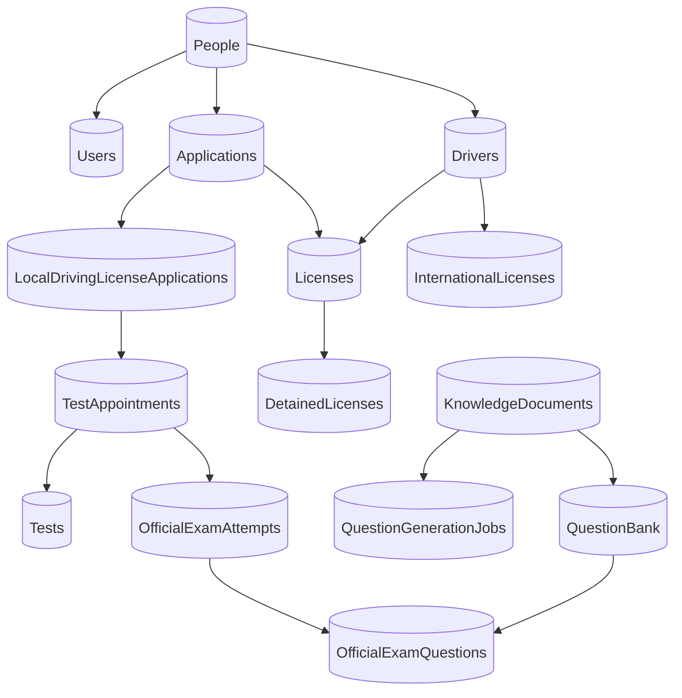

# التشغيل والبيانات ودليل المناقشة

## 1. بيئة التشغيل كما يحددها المصدر

هذه قائمة إعدادات مقروءة من الكود، وليست تقريرًا بأن كل الخدمات شُغّلت أو اختُبرت أثناء إعداد الدليل.

| المكوّن | القيمة الحالية | مصدر القيمة |
|---|---|---|
| Desktop | Windows و`.NET Framework 4.8` | [DVLD.csproj](<J:/gradeat project/DVLD Project Final/Project/DVLD/DVLD.csproj:12>) |
| API وAI | `.NET 10` | [DVLD.Api.csproj](<J:/gradeat project/DVLD Project Final/Project/DVLD.Api/DVLD.Api.csproj>) و[DVLD.AI.csproj](<J:/gradeat project/DVLD Project Final/Project/DVLD.AI/DVLD.AI.csproj>) |
| Business/DataAccess | `net48;net10.0` | ملفا المشروعين |
| API HTTPS | `https://localhost:7077` | [launchSettings.json](<J:/gradeat project/DVLD Project Final/Project/DVLD.Api/Properties/launchSettings.json>) واستدعاءات شاشات الوثائق والتوليد |
| API HTTP | `http://localhost:5277` | ملف launchSettings نفسه |
| اتصال SQL | متغير `DVLD_CONNECTION_STRING` | [clsDataAccessSettings.ConnectionString](<J:/gradeat project/DVLD Project Final/Project/DVLD_DataAccess/clsDataAccessSettings.cs>) |
| Ollama | `http://localhost:11434` | [OllamaEmbeddingService](<J:/gradeat project/DVLD Project Final/Project/DVLD.AI/OllamaEmbeddingService.cs>) و[OllamaChatService](<J:/gradeat project/DVLD Project Final/Project/DVLD.AI/OllamaChatService.cs>) |
| Embedding model | `qwen3-embedding:0.6b` | `OllamaEmbeddingService.ModelName` |
| Chat/question model | `qwen3:1.7b` | `OllamaChatService.ChatModel` و[OllamaQuestionGeneratorService.ModelName](<J:/gradeat project/DVLD Project Final/Project/DVLD.AI/OllamaQuestionGeneratorService.cs>) |
| Qdrant | `localhost:6334` عبر gRPC | [QdrantConnection.CreateClient](<J:/gradeat project/DVLD Project Final/Project/DVLD.AI/QdrantConnection.cs>) |
| Collection | `dvld_knowledge`، 1024 بعدًا، Cosine | `KnowledgeCollectionName / EmbeddingSize / CreateKnowledgeCollectionAsync` |
| Reranker | `http://localhost:8081/rerank` | [LocalRerankerService.RerankAsync](<J:/gradeat project/DVLD Project Final/Project/DVLD.AI/LocalRerankerService.cs>) |

`clsDataAccessSettings` يقرأ متغير الاتصال من Process أولًا ثم User؛ إذا لم يجد قيمة يرمي `InvalidOperationException`. لا يطبع هذا الدليل connection string الحالي أو بيانات تسجيل الدخول.

خدمة reranker عميل HTTP ظاهر في C#، لكن مشروع تشغيل الخادم أو اسم النموذج الذي يشغله ليس موجودًا في الملفات المفحوصة. لذلك يجب الحصول على طريقة تشغيله من إعداد جهاز صاحب المشروع، ولا يختلق الدليل اسم موديل له.

## 2. ترتيب تجهيز نسخة على جهاز آخر

1. افتح [DVLD.sln](<J:/gradeat project/DVLD Project Final/Project/DVLD/DVLD.sln>) وتأكد من وجود المشاريع الخمسة ومراجعها. ثبّت/وفّر أدوات .NET المطابقة للمشاريع واسترجع حزم NuGet. بعض مشاريع المكتبات تستخدم Compile items صريحة؛ وجود ملف جديد على القرص وحده لا يكفي ما لم يكن ضمن csproj.
2. جهّز SQL Server وقاعدة مطابقة لأسماء الجداول والأعمدة التي يستخدمها DataAccess. عيّن `DVLD_CONNECTION_STRING` لكل عملية تحتاج SQL، وأعد فتح Visual Studio أو التطبيق حتى يرى متغير User الجديد عند الحاجة.
3. تأكد من توفر Ollama والنموذجين بالاسمين الموجودين في المصدر. لا تحتاج بيانات المواطنين داخل prompt؛ مسار AI الحالي يستخدم نصوص المعرفة وسؤال المستخدم.
4. جهّز Qdrant والـcollection بتكوين 1024/Cosine. `CreateQdrantCollection` endpoint الحالي ينشئ collection؛ لا تنفذه عشوائيًا على collection موجودة ولا تفترض أن إعادة الإنشاء تحفظ البيانات.
5. شغّل خدمة reranker المحلية وفق إعدادها الفعلي. لا يظهر fallback في search/chat الحالي عند تعطل هذه الخدمة؛ استثناء الاتصال يصل إلى معالج أخطاء API.
6. شغّل API بملف تعريف HTTPS في launchSettings. اسم الملف يحدد عنوان التطوير؛ الثقة بشهادة HTTPS وتوفر المنفذ يحتاجان تحققًا على جهاز التشغيل.
7. شغّل WinForms، وسجّل دخول موظف فعال، ثم اختبر قراءة قائمة صغيرة من SQL قبل تشغيل AI.
8. ارفع PDF تجريبيًا وانتظر جاهزيته. بعد ذلك اختبر بحثًا وشاتًا، ثم دفعة صغيرة من الأسئلة ومراجعتها.

أوامر تشغيل توضيحية من مجلد `Project`، لم تُنفّذ أثناء إعداد الدليل:

```powershell
dotnet run --project .\DVLD.Api\DVLD.Api.csproj --launch-profile https
ollama pull qwen3-embedding:0.6b
ollama pull qwen3:1.7b
```

بناء WinForms يتم عادة من Visual Studio على Windows. الدليل لا يضيف Docker setup أو أوامر لخدمة reranker غير موجودة في المصدر. نجاح `/api/health` وحده لا يختبر SQL أو النماذج أو Qdrant؛ راجع تنفيذ [HealthController](<J:/gradeat project/DVLD Project Final/Project/DVLD.Api/Controllers/HealthController.cs>).

## 3. ما يحفظه كل مخزن

| المخزن | المحتوى في المسار الحالي | ما لا ينبغي افتراضه |
|---|---|---|
| SQL Server | الأشخاص والموظفون والطلبات والمواعيد والرخص، metadata الوثائق، بنك الأسئلة، generation jobs، محاولات الامتحان وأسئلتها ونتائجها | لا يتضمن تلقائيًا الملفات المرفوعة أو vectors الموجودة في Qdrant |
| مجلد ملفات API | PDF الأصلي باسم مخزن ومسار تحفظه SQL | وجود سجل SQL لا يثبت وجود الملف على جهاز آخر |
| Qdrant | vectors للمقاطع مع نصوصها وDocumentID/PageNumber/ChunkIndex | ليس مصدر حالات الاعتماد أو صلاحيات الموظفين |
| ذاكرة API | Channels لطوابير الوثائق وتوليد الأسئلة | ليست queue دائمة قابلة للاسترجاع تلقائيًا بعد إيقاف الخادم |
| ذاكرة Desktop | CurrentUser، Job ID واحد للمتابعة، DataTables للشاشات | لا تبقى جلسة المتابعة تلقائيًا بعد إغلاق التطبيق |

في [KnowledgeDocumentsController.UploadDocument](<J:/gradeat project/DVLD Project Final/Project/DVLD.Api/KnowledgeDocumentsController.cs:28>) يُحفظ PDF في `KnowledgeDocuments` تحت ContentRoot. هذا المجلد مستثنى من Git. عند نقل المشروع، المسارات المطلقة الموجودة داخل `KnowledgeDocuments.FilePath` قد تشير إلى الجهاز القديم؛ نسخة database وحدها لا تعالج ذلك. يمكن إعادة رفع وثائق تجريبية من الواجهة لتكوين بيانات صحيحة للجهاز الجديد بدل افتراض جاهزية ملفات جهاز آخر.

الـBackup المرفق نسخة SQL وليست package تشغيل كاملًا؛ بعد restore يجب التحقق من ملفات PDF وبيانات Qdrant وتوفر النماذج والخدمات. لم يُسترجع الـBackup أو يُفحص كل محتواه ضمن إعداد هذا الدليل.

## 4. خريطة البيانات من أسماء الجداول المستخدمة في SQL

هذه علاقات وظيفية مستنتجة من استعلامات وكائنات الكود؛ ليست إثباتًا لوجود Foreign Keys لكل علاقة في قاعدة المستخدم.



مصادر هذه الخريطة: [clsApplicationData](<J:/gradeat project/DVLD Project Final/Project/DVLD_DataAccess/clsApplication.cs>)، [clsLicenseData](<J:/gradeat project/DVLD Project Final/Project/DVLD_DataAccess/clsLicense.cs>)، [clsTestAppointmentData](<J:/gradeat project/DVLD Project Final/Project/DVLD_DataAccess/clsTestAppointment.cs>)، [clsQuestionBankData](<J:/gradeat project/DVLD Project Final/Project/DVLD_DataAccess/clsQuestionBankData.cs>)، [clsQuestionGenerationJobData](<J:/gradeat project/DVLD Project Final/Project/DVLD_DataAccess/clsQuestionGenerationJobData.cs>) و[OfficialExam migration](<J:/gradeat project/DVLD Project Final/Project/Database/Migrations/OfficialExam_Muhannad_Migration.sql>).

بيانات AI الأساسية:

- `KnowledgeDocuments`: هوية الوثيقة، الاسمان، المسار والحجم، ProcessingStatus وIsActive، TotalPages وChunkCount، التواريخ وErrorMessage. دوال التحميل والتحديث في [clsKnowledgeDocumentData](<J:/gradeat project/DVLD Project Final/Project/DVLD_DataAccess/clsKnowledgeDocumentData.cs>).
- `QuestionBank`: محتوى السؤال والخيارات والإجابة والتفسير، النوع وحالة المراجعة والتفعيل، ومعرف المصدر والصفحة و`SourceEvidence / SourceChunkIndex`. دوال الإضافة والتعديل في [clsQuestionBankData](<J:/gradeat project/DVLD Project Final/Project/DVLD_DataAccess/clsQuestionBankData.cs>).
- `QuestionGenerationJobs`: `QuestionGenerationJobID`، الوثيقة والعددان، `Status`، RequestedAt/StartedAt/FinishedAt، GeneratedQuestionsCount وErrorMessage. هذه قائمة حقول يستخدمها الكود، وليست DDL كاملًا أو توثيقًا لكل constraint.
- `OfficialExamAttempts / OfficialExamQuestions`: دورة جلسة الامتحان ونسخة الأسئلة والإجابات وقت البداية؛ تفاصيل الأعمدة والتصحيح في الدليل 04.

## 5. ملفات migrations وما لا تغطيه

[QuestionBank_Provenance_Migration.sql](<J:/gradeat project/DVLD Project Final/Project/Database/Migrations/QuestionBank_Provenance_Migration.sql>) يضيف `SourceEvidence NVARCHAR(4000)` و`SourceChunkIndex INT` إن لم يوجدا. يفترض وجود جدول QuestionBank مسبقًا، ويتضمن transaction وrollback، ولا ينشئ أسئلة أو يعتمدها.

[OfficialExam_Muhannad_Migration.sql](<J:/gradeat project/DVLD Project Final/Project/Database/Migrations/OfficialExam_Muhannad_Migration.sql>) يجهز بيانات الامتحان الرسمي وحماية التزامن وفق ما يشرحه الدليل 04. وجوده لا يعني أنه نُفذ على كل جهاز.

لا يوجد ضمن ملفات SQL المفحوصة script شامل لكل قاعدة DVLD أو لإنشاء `QuestionGenerationJobs`. لذلك لا تبدأ قاعدة فارغة اعتمادًا على ملفي migrations فقط. الـBackup الحالي أو schema كامل منفصل هو مصدر تجهيز القاعدة الأساسية. لم يُنشأ SQL جديد ضمن مهمة الشرح.

## 6. سياسة الامتحان والتوقيت

قيم [appsettings.json](<J:/gradeat project/DVLD Project Final/Project/DVLD.Api/appsettings.json>) الحالية: 5 أسئلة، النجاح من 4 إجابات صحيحة، مدة 900 ثانية، ونافذة بدء 30 دقيقة قبل الموعد و30 بعده. هذه قيم جهاز التطوير وليست قانونًا ثابتًا أو توصية لحجم امتحان رسمي. السياسة يقرأها الخادم؛ عميل الامتحان لا يختار حد النجاح بإرسال JSON.

يجب التفريق بين DateTime المحلي الذي يظهر في بعض عمليات الرخص وبين UTC المستخدم في مسار الامتحان كما يشرحه الدليل 04. لا توجد نتائج تشغيل تثبت ضبط الساعة والمنطقة الزمنية على أجهزة الفريق؛ تأكد منها عند الاختبار.

## 7. سيناريو عرض متكامل للمشروع

هذا سيناريو مقترح لتجربة الموجود، وليس قائمة اختبارات أُجريت:

1. تسجيل دخول موظف فعال وعرض شخص وطلب ورخصة ومواعيد من البيانات التجريبية.
2. اختيار PDF عربي صالح ورفع الملف، ثم توضيح الفرق بين تقدم الرفع وحالة المعالجة.
3. الانتظار حتى تصبح الوثيقة Active+Ready، وعرض عدد الصفحات والمقاطع.
4. إرسال سؤال للشات تكون إجابته موجودة في الوثيقة، وشرح كيف يسترجع النظام المقاطع ويعيد ترتيبها قبل بناء جواب. أظهر المصادر التي يعيدها API دون الادعاء أن كل جملة في الجواب لها citation منفصل.
5. طلب دفعة صغيرة، مثل 2 MultipleChoice و2 TrueFalse، وعرض Job ID وعودة التطبيق للاستخدام.
6. عند الاكتمال، مراجعة نص سؤال وخياراته وصفحته وتفسيره، ثم اعتماد السؤال أو رفضه. وضح أن Draft لا يساوي Approved.
7. تشغيل سيناريو الامتحان الرسمي من الكمبيوتر المعدّ لذلك؛ أثبت أن العميل يرسل الإجابات والخادم يصحح، باستخدام سياسة التشغيل الفعلية.
8. جرّب مسار فشل بسيط ومفهوم على بيانات تجريبية، مثل وثيقة غير موجودة أو عدم كفاية بنك الأسئلة، دون حذف بيانات لازمة لعرض الفريق.

إذا لم تكن واجهة الشات أو عميل الامتحان في هذا المستودع، اعرض API بعميل HTTP الموجود لديك وأوضح أن المصدر المفحوص هو backend. لا توصف الواجهة بأنها جزء من ملفات DVLD الحالية لمجرد توفر endpoints.

## 8. إجابات عملية للمناقشة

**كيف تستخدمون الذكاء الاصطناعي؟**

لدينا مساران: الشات يستخدم RAG، أي استرجاع مقاطع من الوثائق قبل بناء جواب؛ وتوليد الأسئلة يختار مقاطع مناسبة من وثيقة ثم يطلب سؤالًا من Ollama ويتحقق من شكله ودليله ويحفظه Draft. استخراج النص وتقسيمه وقواعد التحقق ليست كلها عمليات LLM.

**هل تدربون النموذج على الكتاب؟**

لا يظهر fine-tuning أو تدريب أوزان في الكود. الكتاب يُستخرج ويُقسم وتُحسب له embeddings للتخزين والاسترجاع. النموذج يستقبل المقاطع المختارة في الطلب وقت الاستخدام.

**لماذا نحتاج SQL وQdrant معًا؟**

SQL يحفظ السجلات الإدارية وحالات المراجعة والامتحان والعلاقات. Qdrant يستخدم متجهات للعثور على مقاطع مرتبطة بمعنى السؤال. لا يستخدم Qdrant ليقرر نجاح المرشح أو صلاحيات الموظف.

**كيف تمنعون الهلوسة؟**

الشات يتلقى تعليمات بالاعتماد على السياق والامتناع عند غياب الإجابة، ويستخدم مقاطع مسترجعة مع إعادة ترتيب. توليد الأسئلة يعتمد على دليل ينسخه التطبيق من المصدر ويتحقق من وجوده، ثم مراجعة بشرية. هذه وسائل تقليل للمشكلة، وليست ضمانًا مطلقًا لصحة كل جواب؛ لا توجد عتبة ثقة رقمية معايرة في المسار الحالي.

**هل الدليل الموجود يثبت أن الإجابة صحيحة؟**

وجود الدليل يثبت traceability إلى نص المصدر وفق التحقق الحالي. لا يضمن بمفرده أن اختيار الإجابة أو النفي في السؤال صحيح منطقيًا. المراجعة البشرية ضرورية، وخدمة grounding الموجودة كملف لا تُحسب ضمن المسار الفعلي ما لم تُستدعَ.

**هل كل طلب 10 أسئلة يرجع 10؟**

لا؛ إذا نجح جزء من الدفعة يمكن أن تصبح Completed بعدد أقل. العدد الحقيقي في GeneratedQuestionsCount. إذا فشلت كلها تصبح Failed. لا يوجد تفسير لكل سؤال مرفوض في response الحالي.

**لماذا تعمل العملية بالخلفية؟**

إنشاء embeddings أو سؤال قد يحتاج انتظار خدمات محلية وعدة محاولات مصادر. الـAPI يقبل المهمة ويسجل هويتها، والـWorker يتابعها دون حجز نافذة الموظف طوال التوليد. زمن العمل يعتمد على الجهاز والوثيقة والنموذج؛ لم تُقَس سرعات في إعداد هذا الدليل.

**هل توجد خدمات OpenAI مدفوعة مستخدمة؟**

الحزمة مرجعية في AI project، لكن المسارات المشروحة تستخدم HTTP إلى Ollama المحلي. لا يظهر في المسار الحالي استدعاء cloud OpenAI أو مفتاحه. هذا وصف للكود، وليس مقارنة أسعار أو تراخيص بين المنتجات.

**هل المشروع جاهز للمواطنين على الإنترنت؟**

تحديث 2026-10-09: توجد مصادقة Cookie للمواطن والتحقق من ملكية قوائم وتفاصيل بياناته. لكن اتصال Android الحالي HTTP محلي في Debug عبر adb reverse، ولا يثبت جاهزية نشر عام. إعداد Release والخادم والشهادات والخدمات الإدارية يحتاج تحققًا مستقلًا؛ راجع [الفصل 06](06-mobile-and-citizen-auth.md).

## 9. حدود التنفيذ الحالي التي يجب معرفتها

| الحد | أين يظهر؟ | أثره في الشرح والعرض |
|---|---|---|
| صلاحيات الموظفين وEmployee API غير مكتملة | Program/EmployeeApiOnly وclsUser | مصادقة المواطن منفذة، لكنها لا تعني وجود أدوار الموظفين أو إتاحة People API لهم |
| بلع بعض أخطاء قراءات الرخص/الطلبات | `GetLocalDrivingLicenseApplicationInfoByApplicationID` و`GetLicenseClassInfoByID` | خطأ SQL قد يبدو بيانات غير موجودة؛ التفاصيل موثقة في 04 |
| لا score threshold للشات | Chat/Search pipeline | يوجد prompt امتناع وفحص غياب نتائج، لا confidence system مضبوط |
| إعادة المعالجة تحذف vectors القديمة قبل بناء الجديدة | `ReprocessDocument` | لا توجد نسخة مصدر تثبت ارتباط chunk القديم بالجديد؛ التفاصيل في 02 |
| طوابير الذاكرة ليست دائمة | قناتا الوثائق والتوليد | إعادة تشغيل API قد تترك SQL jobs معلقة دون استئناف |
| حفظ دفعة الأسئلة ليس transaction واحدة | `QuestionGenerationProcessingService.ProcessAsync` | فشل INSERT متأخر قد يترك بعض الأسئلة محفوظة رغم Failed |
| Desktop يتابع Job واحدًا | `frmMain.TrackQuestionGenerationJob` | بدء طلب جديد قد يستبدل متابعة القديم |
| إشعار Failed غير معروض | `_QuestionGenerationTimer_Tick` | لا تصف النظام بأنه يعرض سبب فشل التوليد للموظف حاليًا |
| عرض أحدث Draft حسب وثيقة وعدد | `frmManageQuestions._RefreshQuestionsList` | ليست هناك هوية دفعة محفوظة على كل سؤال في هذا المسار |

هذه حدود مسجلة من المصدر ولم تُصلح أثناء التوثيق. الأولويات التي ناقشها صاحب المشروع، مثل الموبايل ثم صلاحيات الموظفين، لا تغيّر وصف ما هو منفذ فعلًا الآن.

## 10. قائمة تحقق قبل التسليم

- Build للمشاريع المطلوبة على جهاز التسليم.
- توفر connection string صحيح والجداول والأعمدة المطلوبة، بدون إرسال كلمات مرور داخل التقرير.
- توفر ملف PDF فعليًا عند المسار الذي يستخدمه API.
- توفر embedding model متوافق مع حجم collection.
- تجربة PDF عربي ذي نص، وPDF ممسوح كصورة لتوضيح عدم وجود OCR في المسار الحالي.
- تجربة نجاح جزئي وفشل للتوليد، ومراجعة العدد الحقيقي.
- تجربة تعديل سؤال معتمد والتأكد من عودته Draft.
- تجربة أسئلة الشات ذات إجابة واضحة وأسئلة لا تكفيها المصادر.
- تجربة الامتحان ضمن وقته والتسليم مرتين وانقطاع العميل على بيئة تجريبية.
- التأكد من أن نسخ SQL وملفات المعرفة وQdrant المطلوبة متوفرة أو يمكن إعادة تكوينها.
- توثيق أي واجهات أو خدمات من مشروع آخر على أنها مكونات منفصلة، مع طريقة تشغيلها الفعلية.

لم تُنفذ هذه القائمة ضمن مهمة إنشاء الدليل؛ الغرض أن يعرف الفريق ما يحتاج اختباره، دون تحويل القراءة الساكنة إلى ادعاء نجاح تشغيل.
