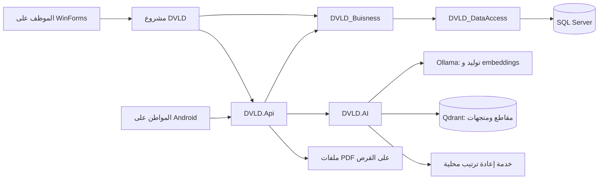

# دليل شرح مشروع DVLD الحالي

هذا الدليل يشرح التنفيذ الموجود، وليس ميزات مقترحة. بدأت الفصول 01–05 بتاريخ 2026-10-06 عند ad66e2a، وحُدث الفهرس وأوصاف المصادقة والموبايل بتاريخ 2026-10-09 وفق main عند 2dc6cab. الفصل 06 يشرح حسابات المواطنين وAndroid. تعديلات تفاصيل الرخص المحلية غير المرفوعة خارج نطاق هذه النسخة.

المجلد المرجعي للمصدر: `J:/gradeat project/DVLD Project Final/Project`.

المرفق `DVLD_Grad_2026-10-06_183357.bak` نسخة قاعدة بيانات SQL Server، وليس ملف تعليمات. أكد صاحب المشروع أن المطلوب إعداد الدليل من الكود الحالي. لم يُسترجع المرفق فوق أي قاعدة بيانات أثناء إعداد هذا الدليل، ولم تُنسخ سجلات المواطنين أو كلمات المرور إلى ملفات الشرح.

## ترتيب القراءة

| الملف | ماذا يشرح؟ |
|---|---|
| [01 — بنية المشروع وشاشات الموظف](01-system-and-desktop.md) | الطبقات، دخول الموظف، إدارة الأشخاص والطلبات والرخص، الوثائق، بنك الأسئلة، شاشة التوليد والمتابعة |
| [02 — AI: معالجة الوثائق والاسترجاع والشات](02-ai-documents-and-chat.md) | استخراج PDF العربي، RTL، التقسيم، embeddings، Qdrant، البحث وإعادة الترتيب، بناء السياق والجواب، حدود الثقة وإعادة المعالجة |
| [03 — AI: توليد الأسئلة بالتفصيل](03-ai-question-generation.md) | اختيار المصادر، توليد JSON، اختيار الدليل، التحقق، التكرار، حفظ Draft، Queue/Worker/Job وحالات الفشل |
| [04 — API والامتحان الرسمي](04-api-and-official-exam.md) | تتبع الرخص والطلبات والمواعيد إلى SQL، بدء الامتحان وحفظ الإجابات والتسليم والتصحيح، حدود المصادقة |
| [05 — التشغيل والبيانات والمناقشة](05-operation-data-and-defense.md) | الخدمات المطلوبة، مصدر الإعدادات، البيانات والعلاقات، سيناريو العرض، أسئلة المناقشة، القيود التي تحتاج تجربة |
| [06 — الموبايل وحسابات المواطنين](06-mobile-and-citizen-auth.md) | Cookie Authentication وملكية البيانات وإدارة الحساب من Desktop وتدفق Android والتشغيل المحلي |

## الصورة العامة

WinForms يستخدم Business/DataAccess مباشرة لمعظم الإدارة، ويستخدم HTTP للعمليات المتصلة بالـAI. SQL يحفظ بيانات الإدارة وبنك الأسئلة وحالات المعالجة والامتحان؛ Qdrant يحفظ المقاطع ومتجهاتها؛ ملف PDF يبقى على القرص. هذه مخازن مختلفة، ولا تعني نسخة SQL الاحتياطية أنها تتضمن ملفات PDF أو بيانات Qdrant.

## حدود ما يثبت هذا الدليل

- أسماء الملفات والدوال والقيم المذكورة مأخوذة من الكود الذي فُحص.
- الأمثلة التعليمية لطلبات JSON أو تدفق البيانات ليست نتائج اختبار تشغيل، وأرقام المعرّفات فيها أمثلة فقط.
- لم يُنفّذ Build، ولم تُرسل طلبات للـAPI أو للنماذج، ولم تُغيّر قاعدة البيانات أثناء إعداد الدليل.
- وجود دالة أو endpoint يثبت توفر التنفيذ في المصدر؛ لا يثبت تشغيل الخدمة الخارجية أو جودة نتائجها على كل وثيقة.
- الامتحان الرسمي مخصص للكمبيوتر. تطبيق Android موجود ويشمل Login وDashboard وقوائم الرخص؛ تفاصيل نطاقه موثقة في الفصل 06.
- توثق ملفات الشرح النواقص كما هي؛ لا تمثل تنفيذًا للصلاحيات أو abstention مضبوط بالدرجات أو versioning للمصادر.

لتتبع مسار AI كامل: ابدأ من رفع الوثيقة في الدليل 02، ثم توليد الأسئلة واعتمادها في 03، ثم استهلاك الأسئلة المعتمدة بالامتحان في 04. للشات، تابع 02 حتى نهاية قسم بناء السياق والجواب.
